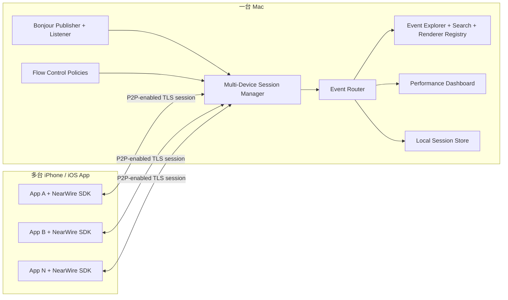
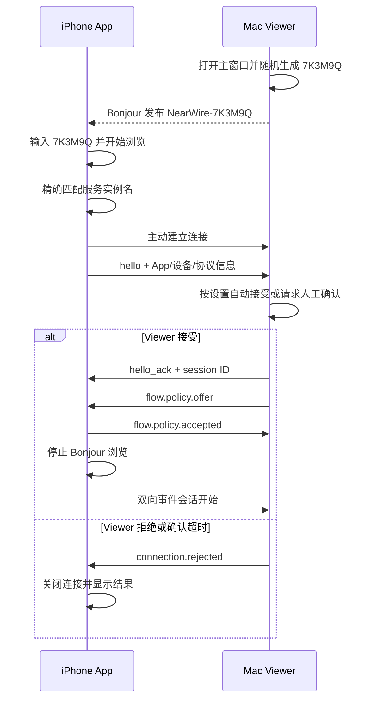

# NearWire 双向事件平台方案

> 状态：方案评审稿，不进入实现
> 日期：2026-07-11
> 使用范围：团队内部
> 核心形态：iOS SDK + macOS Viewer，无中心服务、无云端依赖

## 1. 方案摘要

NearWire 是一个运行在 iPhone App 与 Mac Viewer 之间的双向事件平台。

任意接入 NearWire SDK 的 App，都可以通过统一 API 向 Mac Viewer 发送事件；Mac Viewer 也可以向指定 App 发送事件。日志、业务状态、调试信息、测试指令和自定义数据，都通过同一种事件模型承载。

方案采用以下核心决策：

1. iPhone 与 Mac Viewer 使用 Network.framework 建立直接连接。
2. 所有发现、监听和连接参数都启用 `includePeerToPeer`，并通过 Bonjour 自动发现 `_nearwire._tcp` 服务。
3. 不建设中心服务，不引入账号、云存储或互联网中继。
4. Mac Viewer 启动时随机生成一串“对频码”，并把它作为 Bonjour 服务实例名的一部分；手机输入相同对频码后，只查找并连接对应 Viewer。
5. 一台手机同一时间只允许一个 Mac Viewer 持有连接；一个 Mac Viewer 可以同时连接多台手机。
6. App 与 Mac Viewer 都能发送和接收事件，事件至少包含“事件类型”和“事件内容”。
7. Mac Viewer 为每台手机配置两个方向的事件速率：App 上行最高频率和 App 下行最高频率。
8. 超出速率的事件进入有上限的队列；平台同时提供过期、优先级、合并和溢出处理，避免无限堆积。
9. 业务连接默认且强制使用 TLS；Viewer 自动生成自签名证书，iPhone 不校验证书身份。TLS 只提供传输加密和完整性，不提供 Viewer 身份认证，也不允许失败后降级为明文。
10. iOS SDK 使用 Swift 原生实现，最低支持 iOS 16，同时通过 Swift Package Manager 和 CocoaPods 交付。
11. SDK 对外提供实例类型 `NearWire`，不提供全局单例；核心能力与 UI 解耦，可选 UI 组件单独放在 `NearWireUI` 中。
12. V1 只提供“普通发送”和“只保留最新值”两种业务事件策略，手机端只使用有上限的内存缓存，不做事件 ACK、磁盘队列或跨进程可靠投递。
13. Mac Viewer 是最低支持 macOS 13 的 SwiftUI 原生 App；打开后立即监听，默认自动接受手机连接，并允许用户开启新设备确认。
14. Viewer 默认把 App 上行事件保存在 Mac 本地，默认容量预算 3 GiB、默认保留 7 天；两项均可配置，并配套自动清理和保护规则。
15. NearWire 在通用事件平台之上提供可选的官方内建事件。V1 首个内建能力是聚合性能快照，Viewer 为其提供专用分析页面，但普通事件协议仍是平台唯一基础。
16. 项目采用单仓库结构，根目录包含 `Package.swift`、`NearWire.podspec` 和 workspace；共享代码、iOS SDK、macOS Viewer 分别位于 `Core`、`SDK`、`Viewer`。
17. SDK 使用 Swift 5 语言模式并由 Xcode 16 构建；Core 和 SDK 不引入第三方运行时依赖，Viewer 允许少量经过评审的主流依赖。

需要说明的是，`includePeerToPeer = true` 的公开语义是“把 Apple P2P 接口加入候选”，不是“强制系统只能走 P2P”。即使 NearWire 全量启用 P2P，iPhone 与 Mac 在同一局域网时，Network.framework 仍可能选择普通 LAN 路径。NearWire 可以保证“始终允许 P2P、无需共同路由器”，不能承诺物理链路一定是 AWDL。Apple 的公开建议也是通过 Network.framework 开启 peer-to-peer Wi-Fi，并结合 Bonjour 发布、浏览和连接服务。[Apple TN3151](https://developer.apple.com/documentation/technotes/tn3151-choosing-the-right-networking-api)

## 2. 产品目标与边界

### 2.1 目标

- 为团队内部 iOS App 提供统一的双向事件通道。
- 手机和 Mac 靠近即可发现和连接，不依赖 USB、共同路由器或独立服务端。
- 接入方可以通过 Swift Package Manager 或 CocoaPods 集成 SDK，在手机端提供对频码输入界面并调用事件 API；对频码由 Mac Viewer 自动生成并展示。
- Mac Viewer 能同时观察和控制多台测试手机。
- 所有事件都可以实时查看、筛选、保存、回放和导出。
- 平台具备明确的流量控制、队列状态和丢弃统计，不让调试通道反过来拖慢宿主 App。
- 不同类型的 App 事件使用同一套传输、发现、连接、队列和展示基础设施。
- 为常见场景提供官方事件模型和 Viewer 专用页面，同时不要求普通业务事件依赖这些内建能力。

### 2.2 非目标

- 不支持跨城市或跨互联网 NAT 的远程连接。
- 不建设账号系统、中心数据库或云端 Relay。
- 不保证 App 进入后台、被锁屏或被系统挂起后持续在线。
- 不允许 Mac Viewer 直接执行任意 Swift 代码。
- 不把任意 Swift 对象自动反序列化为运行时代码；V1 只支持受控、可验证的事件内容格式。
- 不承诺 iOS 公共 API 没有提供的系统级实时指标，例如整机 GPU 利用率、实时功耗瓦数或摄氏温度。
- 不承诺 exactly-once，也就是“无论任何故障都只处理一次”。这种语义需要持久化事务系统，不适合当前本地实时工具。
- V1 不把大文件传输、屏幕串流或远程桌面塞进普通事件内容；这些能力需要独立流式协议。

## 3. 总体架构



### 3.1 iPhone 角色

iPhone 是 Bonjour 服务浏览者和主动连接者：

- 用户输入 Mac Viewer 显示的对频码。
- 浏览 `_nearwire._tcp`，只匹配按该对频码生成的完整服务实例名。
- 找到目标后主动建立连接。
- 同一时间只维护一条 Viewer 会话，连接后停止 Bonjour 浏览。
- 执行 App 上行限速和发送队列。
- 执行 App 下行接收队列和事件分发。
- 暴露 SDK API 给宿主 App 发送、订阅和响应事件。

### 3.2 Mac Viewer 角色

Mac Viewer 是 Bonjour 服务发布者和连接监听者：

- 主窗口打开后随机生成对频码，并立即发布对应的 `_nearwire._tcp` 服务实例。
- 持续监听手机连接，不需要预先发现每台 App。
- 同时接受并管理多台手机会话。
- 默认自动接受新手机；设置中可改为新设备首次接入时要求人工确认。
- 设置每台手机的上行、下行最高事件频率。
- 接收、筛选、展示、保存事件。
- 向单台或一组已选手机发送事件。

### 3.3 连接基数

```text
Phone 1 ─┐
Phone 2 ─┼──> 一个 Mac Viewer
Phone 3 ─┘

每台 Phone：最多 1 个活动 Viewer
每个 Viewer：可连接多台 Phone
```

V1 建议把 Mac Viewer 的产品目标设为同时连接 16 台手机。协议本身不把 16 写死，但需要用压力测试证明更高数量是否可用。

## 4. P2P 与 Bonjour 设计

### 4.1 统一启用 P2P

以下对象使用的参数都设置：

```swift
parameters.includePeerToPeer = true
```

- Mac 的 `NWListener`
- iPhone 的 `NWBrowser`
- iPhone 创建的 `NWConnection`
- Mac 接受连接后对应的 connection path

这使 NearWire 不需要区分“LAN 模式”和“Nearby 模式”。同一份配置既能使用基础设施 Wi-Fi，也允许系统使用 Apple peer-to-peer Wi-Fi。[peerToPeerIncluded](https://developer.apple.com/documentation/network/nwparametersprovider/peertopeerincluded(_:))

### 4.2 Bonjour 服务

建议服务类型：

```text
_nearwire._tcp
```

NearWire 只有这一种服务类型，所有连接都强制使用 TLS，因此不再额外发布 `_nearwire-ssl._tcp`，也不发布明文兼容服务。服务类型负责标识 NearWire 协议，是否加密由协议规范固定，而不是由服务类型名称决定。

Bonjour 实例名称直接由 Mac Viewer 随机生成的对频码构成，例如：

```text
NearWire-7K3M9Q
```

完整 Bonjour 名称类似：

```text
NearWire-7K3M9Q._nearwire._tcp.local.
│                    │
│                    └─ 固定服务类型
└─ 服务实例名，其中 7K3M9Q 是对频码
```

对频码和服务实例名用于发现与选择 Viewer，不是密码。它会通过 Bonjour 广播，对附近能够浏览该服务的设备可见。

TXT Record 只放发现所需的非敏感数据：

| 字段 | 说明 |
|---|---|
| `pv` | 协议主版本 |
| `vid` | Viewer installation ID 的截短摘要 |
| `viewer` | Viewer 的非敏感显示名 |
| `state` | `accepting`、`paused` |
| `cap` | 能力位，例如 bidirectional、normal、keep-latest |

禁止放入：

- 对频码之外的口令、认证信息或可验证哈希。对频码已经公开体现在实例名中，无需在 TXT Record 重复。
- 用户账号、手机设备名称、宿主 App 信息或真实业务内容；这些信息在连接后的 `hello` 中发送。
- 会话密钥、TLS 私钥或长期身份凭证。
- 事件内容。

### 4.3 发布生命周期

```text
Mac Viewer 主窗口未打开
  -> 不发布

Mac Viewer 主窗口打开
  -> 从 Keychain 加载 TLS identity；不存在则自动生成并保存
  -> TLS identity 就绪后安全随机生成对频码
  -> 发布 NearWire-<code>

TLS identity 初始化失败
  -> 不发布 Bonjour 服务
  -> Viewer 显示错误和“重置 TLS 身份”操作

一台或多台手机输入对频码
  -> 浏览并连接该服务

手机连接成功
  -> 该手机停止浏览
  -> Mac 继续发布，允许其他手机接入

Viewer 刷新对频码
  -> 停止旧实例发布
  -> 生成新码并发布新实例
  -> 默认不主动断开已经建立的会话
```

Mac 不能在第一台手机连接后停止发布，因为产品要求一个 Viewer 同时连接多台手机。手机在建立活动会话后停止浏览，由手机端状态机自然落实“一台手机只连接一个 Viewer”。Viewer 可以暂停接受新设备；暂停只影响新连接，不影响已有会话。

### 4.4 局域网权限

宿主 App 仍需要声明：

- `NSLocalNetworkUsageDescription`
- `NSBonjourServices` 中的 `_nearwire._tcp`

Swift Package 和 CocoaPods 都无法替宿主 App 正确填写业务语境下的隐私说明，所以 NearWire 应提供清晰的接入检查和示例文本。Apple 建议使用 `NWBrowser`、`NWListener` 和 Bonjour 处理本地设备发现。[Apple Local Network Privacy](https://developer.apple.com/documentation/technotes/tn3179-understanding-local-network-privacy)

## 5. 对频码、服务实例名与连接准入

### 5.1 对频码定义

“对频码”是 Mac Viewer 随机生成的公开连接标识。它直接映射为 Bonjour 服务实例名，用于让手机从附近的 `_nearwire._tcp` 服务中找到正确 Viewer。它的目标是降低误连和重名概率，不承担密码或身份认证职责。

建议格式：

- 使用 6 位大写易读字符。
- 排除容易混淆的 `0/O`、`1/I/L`。
- 由 Mac Viewer 使用系统安全随机数生成器生成，不允许用时间戳或普通伪随机数拼接。
- 手机输入时忽略大小写、空格和连字符，规范化后再匹配。
- Viewer 打开主窗口时自动生成并醒目展示；提供“复制”和“刷新对频码”操作。
- 当前 Viewer 运行期间保持不变，除非用户主动刷新。
- 刷新对频码只影响后续发现和新连接；已有会话默认保持，用户也可以选择“刷新并断开全部设备”。

字符集固定为 `ABCDEFGHJKMNPQRSTUVWXYZ23456789`，共 31 个字符；6 位组合共有 `31^6 = 887,503,681` 种。它不能从数学上保证绝不重复，但对团队内部同时运行的少量 Viewer 来说，随机碰撞概率已经很低。随机长度未来可以扩展，而不改变协议结构。

服务实例名的生成规则固定为：

```text
normalize("7k3m-9q") -> 7K3M9Q
service instance name -> NearWire-7K3M9Q
```

对频码在 iPhone SDK 中只保存在内存，不写入 `UserDefaults`、Keychain、数据库或文件：

- `connect(code:)` 对输入进行规范化，并在当前进程生命周期内保存规范化结果。
- 发现中、连接中或临时断线重连时继续使用内存中的对频码，用户不需要因一次网络抖动重新输入。
- 用户主动调用 `disconnect()` 时立即清除对频码并停止发现、连接和重连。
- App 进程退出或被系统终止后对频码自然消失；下次启动需要重新输入。
- SDK 日志和错误信息不得输出完整对频码，避免把无关的发现标识混入业务日志。

### 5.2 用户流程



### 5.3 重名和异常处理

正常情况下，一台 Mac 只发布一个对频码，多台手机只是服务浏览者，因此多台手机输入同一个码不会产生 Bonjour 实例名冲突。这也是选择“Mac 发布、iPhone 浏览”拓扑的重要原因。

异常规则：

- 同一可见网络中两台 Viewer 恰好使用相同码时，Bonjour 可能为其中一个实例自动改名，手机也可能看到歧义结果。
- Viewer 应检查实际注册的实例名；发现系统改名或注册冲突时，自动刷新对频码并在界面提示。
- 手机找不到完全匹配的实例时保持等待，不回退到“连接第一个 NearWire 服务”。
- 如果手机观察到多个逻辑上匹配的 Viewer，不自动选择，提示用户让目标 Viewer 刷新对频码。
- 因为对频码本来就是公开广播信息，协议不再增加口令派生、口令校验或失败退避流程。

### 5.4 轻量连接准入

V1 默认可以自动接受使用正确服务实例建立的 NearWire 连接。团队若希望避免无意接入，可在 Viewer 开启“新设备接入时确认”：

```text
新设备接入
App：DemoStore
设备：Tangent 的 iPhone
[拒绝] [接受]
```

人工确认只是一层产品准入，不把对频码变成安全凭证。Viewer 仍需限制待确认连接数量、握手消息大小和确认超时，防止无效连接占用资源。

### 5.5 安装身份与会话身份

两端各自生成随机 installation ID 并保存在 Keychain：

- `phoneInstallationID`
- `viewerInstallationID`

它们用于区分设备、重连偏好和本地会话归档，不代表真实用户身份。每次连接成功生成新的 session ID；V1 不增加长期连接凭证。

### 5.6 信任边界

对频码会出现在 Bonjour 服务实例名中，附近设备可以看到，因此 NearWire V1 的信任前提是团队内部、受控的本地或近距离 P2P 环境。随机码主要解决误连和实例重名，不防御主动冒充、中间人或有意接入。

业务事件通过 TLS 加密，但 V1 采用与 NSLogger 类似的自签名信任方式：iPhone 接受 Viewer 提供的自签名证书，不校验证书链、主机名或历史指纹。因此切换 Viewer 不需要清理信任记录，但主动冒充和中间人攻击仍属于明确接受的剩余风险。

如果未来需要在不可信环境使用，应在对频码之外增加独立的身份认证机制；不能把公开的服务实例名或当前 TLS 加密直接升级解释为身份认证。

## 6. 单手机独占与多手机管理

### 6.1 App 进程级 Connection Lease

公开 API 采用实例模式，但“一台手机只能连接一个 Viewer”的约束必须在整个 App 进程内成立，而不能只约束单个 `NearWire` 实例。SDK 内部维护一个轻量的进程级 connection lease：

```text
idle
  -> browsing(code)
  -> connecting(viewerID)
  -> active(viewerID, sessionID)
  -> reconnecting(viewerID, deadline)
  -> browsing(code)
```

App 可以创建多个 `NearWire` 实例，但规则如下：

- `active` 状态停止 Bonjour 浏览，不再发起第二条 Viewer 连接。
- 第一个调用 `connect(code:)` 并取得 lease 的实例拥有发现、连接和重连权。
- 其他实例可以独立构造和持有，但在 lease 被占用时调用 `connect(code:)`，立即抛出 `NearWireError.anotherConnectionIsActive`，不得悄悄复用或抢占第一条连接。
- 持有者调用 `disconnect()`、被销毁，或连接流程明确终止后释放 lease；其他实例随后可以连接。
- lease 只是 SDK 内部的连接互斥机制，不把事件 API 或 `NearWire` 对象做成公开单例，也不暴露 `shared` 入口。
- 连接刚断开时进入 15–30 秒重连保护期。
- 保护期内优先匹配 TXT Record 中的 `vid`，连接后再用 `hello` 中的完整 viewer installation ID 确认是原 Viewer。
- 用户可以在 App 内点击“解除 Viewer”，由当前实例调用 `disconnect()`，立即取消 lease、清除内存中的对频码并停止连接。
- 用户要输入新对频码时，必须先主动断开当前流程，再用新码调用 `connect(code:)`，避免一次 API 调用隐式替换目标 Viewer。

### 6.2 Mac Multi-Device Session Manager

Mac Viewer 按手机 installation ID 管理独立 session actor：

```text
DeviceSessionManager
  ├─ PhoneSession A
  ├─ PhoneSession B
  ├─ PhoneSession C
  └─ PhoneSession N
```

每个 PhoneSession 独立维护：

- 连接状态。
- Viewer 准入和握手状态。
- 上行、下行限速配置。
- 收发序列号。
- 发送队列和接收队列。
- 事件筛选和本地保存状态。
- 重连策略。

任何一台手机断开、阻塞或事件爆量，都不能拖慢其他手机会话。

## 7. 通用双向事件模型

### 7.1 最小业务字段

事件调用方必须提供：

```text
type     事件类型
content 事件内容
```

SDK 自动补全协议字段：

```text
id
timestamp
monotonicTimestamp
source
target
direction
sequence
priority
ttl
correlationID
schemaVersion
```

建议的逻辑结构：

```json
{
  "id": "01J...",
  "type": "app.state.changed",
  "content": {
    "screen": "checkout",
    "status": "active"
  },
  "timestamp": "2026-07-11T10:20:30.123Z",
  "sequence": 1024,
  "priority": "normal",
  "ttlMs": 60000,
  "schemaVersion": 1
}
```

### 7.2 Content 数据类型与 Codable API

V1 的线上格式将 `content` 限定为 JSON-compatible value：

- `null`
- `Bool`
- `Int64` / `Double`
- `String`
- `[Value]`
- `[String: Value]`

Swift SDK 的主要入口接受符合 `Encodable` 的 Swift 类型，调用方不需要手工拼接字典：

```swift
struct LoginEvent: Codable, Sendable {
    let userID: String
    let method: String
}

try await nearWire.send(
    type: "user.login",
    content: LoginEvent(userID: "123", method: "password")
)
```

SDK 使用统一的 `JSONEncoder` 配置把内容转换为线上 JSON value，完成类型、深度和大小校验后才允许入队。接收到的 `NearWireEvent` 同时提供原始 JSON 内容和 `decode(_:using:)` 泛型方法：

```swift
let login = try event.decode(LoginEvent.self)
```

解码失败只影响当前事件，由调用方得到明确的 `contentDecodingFailed` 错误，不终止连接或其他事件的分发。禁止自动归档任意 NSObject、类名或可执行对象，避免不安全反序列化。

二进制内容不直接塞进普通事件。V1 可以允许小型 Base64 数据，但默认单事件上限仍生效；图片、日志文件和大型附件在后续使用独立 attachment stream。

### 7.3 事件类型命名

建议采用点分命名空间：

```text
log.message
ui.route.changed
network.request.summary
test.step.started
debug.command.refreshCache
feature.flag.override
business.order.stateChanged
custom.sensor.sample
```

保留命名空间：

```text
nearwire.*
```

它只用于协议控制和平台自身状态，普通 SDK 调用方不能伪造。

### 7.4 双向语义

全文固定使用以下方向定义，避免从 Viewer 视角和 App 视角混用“上行/下行”：

```text
App 上行：App -> Viewer，以数据、状态、日志和性能样本为主
App 下行：Viewer -> App，以控制、调试和测试指令为主
```

App 上行示例：

```text
App -> Viewer
log.message
ui.route.changed
test.assertion.failed
business.order.stateChanged
```

App 下行示例：

```text
Viewer -> App
debug.command.clearCache
feature.flag.override
test.command.openRoute
app.configuration.update
```

Mac Viewer 发送事件并不代表 SDK 自动执行命令。宿主 App 必须显式注册相应事件处理器。未注册的事件只记录或返回 `unhandledEventType`，不能触发任意反射调用。

### 7.5 请求与响应

通过 `correlationID` 和 `replyTo` 支持请求响应：

```text
Viewer -> App
type: debug.snapshot.request
id: request-123

App -> Viewer
type: debug.snapshot.response
replyTo: request-123
```

这仍是两个普通事件，不引入另一套 RPC 协议。

### 7.6 多手机目标

Viewer 发送事件时必须明确目标：

- 单台手机。
- 用户勾选的一组手机。
- 所有当前已连接手机。

对多手机发送时，Viewer 为每台手机生成独立传输记录和结果，不定义跨设备原子事务。一台失败不能回滚其他手机已经收到的事件。

## 8. 协议分层

### 8.1 两条逻辑通道

同一条加密连接上划分两条逻辑 lane：

1. Control Lane
   - `hello`
   - `connection.*`
   - `flow.policy.*`
   - `ping/pong`
   - `disconnect`
   - `error`

2. Event Lane
   - `event`
   - `event.batch`
   - `event.dropSummary`

Control Lane 不受用户配置的事件频率限制，否则调整限速或断开连接的消息可能被堵在事件队列后面。但 Control Lane 本身也要有内部硬限制和最大消息尺寸，防止被滥用。

### 8.2 握手能力协商

连接开始时交换：

```text
protocolVersion
minimumCompatibleVersion
sdkVersion / viewerVersion
supportedCodecs
maximumEventBytes
supportedSendPolicies
supportedCapabilities
phoneInstallationID / viewerInstallationID
```

版本不兼容时在业务会话开始前终止，并向用户给出可操作提示，例如“Viewer 版本过低，请升级到 2.0 或更高版本”。

### 8.3 编码与 framing

V1 建议：

- 传输：TLS + WebSocket，或 TLS + length-prefixed TCP。
- TLS 是强制层；两种 framing 方案都不能提供明文模式或 TLS 失败后的自动降级。
- Mac Viewer 首次启动时自动生成自签名证书和私钥，组成 TLS server identity 并保存到 Keychain。
- iPhone SDK 使用自定义 trust 回调接受该自签名证书，不校验证书链、主机名，也不持久化证书指纹。
- 事件内容：JSON/Codable。
- 多事件批量：`event.batch`。
- 不对小包默认压缩；达到批次尺寸阈值后再启用压缩。

WebSocket 的优势是消息边界清晰，也方便后续复用调试工具；length-prefixed TCP 的依赖和开销更低。二者应在 Phase 0 通过真机开销和实现复杂度比较后选定。Network.framework 原生支持 WebSocket protocol options。[NWProtocolWebSocket](https://developer.apple.com/documentation/network/nwprotocolwebsocket/options)

### 8.4 顺序

- 每台手机、每个方向维护独立单调递增 sequence。
- 同一方向的事件按进入发送队列的顺序发送。
- 不保证不同手机之间的全局顺序。
- 重连后通过 session epoch 区分旧 sequence 与新 sequence。
- `keepLatest` 合并事件允许跳号，但必须产生 drop/coalesce 统计。

## 9. Mac Viewer 配置的双向限速

### 9.1 两个主配置

每台已连接手机在 Mac Viewer 中显示：

```text
App 上行最高频率：N events/s
App 下行最高频率：M events/s
```

定义：

- App 上行最高频率：该 App 每秒最多从发送队列放行多少个业务事件到 Viewer。
- App 下行最高频率：Viewer 每秒最多向该 App 放行多少个业务事件。

配置按手机独立保存。Viewer 还可以提供“新设备默认值”，批量应用给后续连接的手机。

建议默认值：

```text
App 上行：20 events/s
App 下行：10 events/s
```

这些只是初始安全值，应由真实事件大小和测试结果校准。

### 9.2 Viewer 与 App 共同决定最终速率

Viewer 提供会话期望值，App 接入方通过 `NearWire.Configuration` 提供自己能够接受的本地上限。每个方向最终生效值都取两者中更保守的值：

```text
effectiveUplink   = min(viewerRequestedUplink, appMaximumUplink)
effectiveDownlink = min(viewerRequestedDownlink, appMaximumDownlink)
```

Viewer 不能把 App 的本地上限调高，App 也不能突破 Viewer 针对当前设备设置的限制。任意一端配置为 0，都表示暂停该方向的业务事件，但 Control Lane 继续工作。

对上行：

```text
Viewer 请求上行 R，App 本地上限为 A
  -> 通过 Control Lane 下发给 App
  -> App 计算 min(R, A) 并在发网前按实际值出队
  -> Mac 接收端再做安全校验和分发限速
```

对下行：

```text
Viewer 请求下行 D，App 本地上限为 B
  -> 双方协商 min(D, B)
  -> Viewer 在发网前按实际值出队
  -> App 接收端再按实际值控制交付给宿主处理器
```

发送端限速是节省网络和功耗的主要机制。接收端队列只能保护处理器和 UI；如果事件已经传过网络，接收端再延迟并不能追回已消耗的无线功耗。

### 9.3 Policy Offer / Accept

Mac 下发：

```json
{
  "type": "nearwire.flow.policy.offer",
  "uplinkEventsPerSecond": 20,
  "downlinkEventsPerSecond": 10
}
```

App SDK 根据接入方配置的本地上限和 SDK 硬性安全边界校验、裁剪，然后回复：

```json
{
  "type": "nearwire.flow.policy.accepted",
  "effectiveUplinkEventsPerSecond": 20,
  "effectiveDownlinkEventsPerSecond": 10
}
```

Viewer UI 必须同时展示“请求值”和“实际生效值”，不能假设 App 无条件接受无限速配置。

### 9.4 限速算法

使用 token bucket，而不是简单的整秒计数：

- `rate`：每秒补充多少 token。
- 一个普通事件消耗一个 token。
- `burstCapacity`：默认允许最多 2 秒额度的短时突发。
- 没有 token 的事件进入队列。
- scheduler 按稳定节奏批量出队。

Token bucket 能允许短暂突发，又避免固定时间窗在秒边界出现双倍流量。

### 9.5 事件频率不等于网络发送频率

只限制 events/s 仍可能产生大量小网络包。NearWire 内部还需要一个批次调度器：

```text
事件限速：20 events/s
网络 flush：2 batches/s

每 500 ms 将已获准的事件合并为一个 event.batch
```

`flushesPerSecond` 建议作为高级参数或 SDK 内部策略，不必占用 Viewer 主界面的第三个输入框。默认 2 次/秒，低延迟模式可临时提高。

### 9.6 还需要字节限制

仅限制事件个数不够：一个事件可能只有 50 字节，也可能有 10 MB。

V1 建议增加以下硬限制：

| 限制 | 建议默认值 |
|---|---:|
| 单事件编码后大小 | 256 KiB |
| 单批次大小 | 512 KiB |
| iPhone 每个业务队列事件数 | 1,000 |
| iPhone 每个业务队列字节数 | 4 MiB |
| Viewer 每台手机每方向事件数 | 5,000 |
| Viewer 每台手机每方向字节数 | 16 MiB |
| 默认事件 TTL | 60 秒 |
| 默认网络 flush | 2 次/秒 |

Viewer 的两个 events/s 输入框是主要产品配置；字节和队列限制放在高级设置或 SDK 固定安全上限中。

## 10. 队列与背压

### 10.1 四个队列

每个 PhoneSession 逻辑上有：

```text
iPhone:
  App Uplink Send Queue
  App Downlink Delivery Queue

Mac Viewer:
  Viewer Downlink Send Queue
  Viewer Uplink Delivery Queue
```

网络接收 callback 只负责验证、解码和入队，不直接执行业务 handler 或更新复杂 UI。

### 10.2 队列不能无限增长

如果生产速度长期高于配置速率，例如 App 持续产生 100 events/s，而上行限制为 10 events/s，那么任何有限队列最终都会装满。平台必须定义溢出策略，不能只说“等待发送”。

V1 的公开发送策略只提供两种：

| 公开策略 | 适用场景 | 实际行为 |
|---|---|---|
| `.normal` | 日志、离散业务事件、普通调试事件 | 按入队顺序保存在有上限的内存队列；达到上限时淘汰最旧的普通事件 |
| `.keepLatest(key:)` | FPS、进度、当前页面、设备状态 | 同一个 key 在待发送队列中只保留最新一条，旧值被替换 |

统一规则：

- 没有指定策略时使用 `.normal`。
- 未连接、正在发现、正在连接、临时断线或受到限速时，两种策略都可以进入内存队列。
- V1 不提供 `dropNewest`、挂起调用方、写入手机磁盘或“必须确认收到”的公开模式。
- 无论哪种策略，单事件过大、内容编码失败或参数非法时都立即抛出错误，不进入队列。
- 队列淘汰、合并和过期都必须记入统计，但不把一次被动淘汰变成宿主 App 崩溃或同步阻塞。

### 10.3 优先级

业务事件支持：

```text
low
normal
high
critical
```

优先级只影响队列的出队顺序，不改变 `.normal` 或 `.keepLatest` 的交付保证。队列采用加权公平调度，而不是让 critical 永远饿死其他优先级；需要溢出淘汰时，先从最低优先级中选择最旧事件。Control Lane 独立保留容量。

### 10.4 TTL

事件超过 `ttl` 后不再发送或交付。例如一条“打开某个页面”的测试命令排队 2 分钟后已经没有意义，应产生 `expired` 结果，而不是突然执行。

### 10.5 合并

对于状态型事件：

```text
progress.download
ui.currentRoute
```

调用方通过 `.keepLatest(key:)` 设置合并 key。队列中已经存在同 key 事件时，用新内容替换旧内容。key 由调用方显式提供，不强制等于事件 `type`，因此同一事件类型可以维护多个独立状态序列。这样能显著降低高频状态对功耗和 Viewer UI 的影响。

### 10.6 队列可观测性

Mac Viewer 对每台手机展示：

- 当前上行/下行队列深度。
- 队列字节数。
- 最老事件等待时间。
- 每秒入队、出队事件数。
- dropped、expired、coalesced 数量。
- 当前有效限速配置。

平台定期生成保留事件：

```text
nearwire.queue.stats
nearwire.event.dropSummary
```

这些控制统计不进入普通事件限速队列。

## 11. V1 发送与交付语义

### 11.1 两种发送策略

`.normal` 表示普通排队发送：SDK 接受事件后先放入有上限的内存队列，连接可用且获得发送额度时按顺序发送。`.keepLatest(key:)` 表示状态合并：同一 key 尚未发出的旧事件会被新事件替换。

这两个策略描述的是“事件在本地等待发送时如何排队”，不是两套网络协议，也不是到达保证等级。

### 11.2 TCP 可靠不等于业务确认

连接存活期间，TCP/TLS 会负责有序传输和网络丢包重传，因此 NearWire 不需要自己逐包重传。但 V1 不增加接收方业务 ACK，所以以下情况仍可能导致事件最终没有被宿主处理：

- 事件在内存队列中等待时 App 被终止。
- 队列达到上限后事件被淘汰。
- 事件超过 TTL 后过期。
- 连接在发送边界突然断开，发送方无法判断接收方业务层是否已经处理。
- 接收方没有注册对应事件处理逻辑，或者内容解码失败。

`send` 成功只表示事件已经通过校验并被 NearWire 本地队列接受，不表示 Viewer 或 App 的业务处理器已经执行完成。

### 11.3 V1 明确不提供的保证

V1 不提供事件级 ACK、自动重试到确认、跨进程磁盘恢复、at-least-once 或 exactly-once。请求与响应仍可通过两个带 `correlationID` 的普通事件完成，但响应超时和业务失败由调用方显式处理。

如果未来出现“Viewer 发出的某类指令绝对不能丢”的真实需求，再新增独立的“确认送达”能力，并同时设计 ACK、去重、重试期限、幂等约束和磁盘策略；不在 V1 里留下半套语义。

## 12. iOS SDK 设计

### 12.1 交付形式与系统要求

V1 锁定以下要求：

- 最低支持 iOS 16。
- SDK 使用 Swift 原生代码实现；公开 API 也以 Swift 调用体验为第一优先级。使用 Xcode 16 编译器和 Swift 5 language mode。
- 同时支持 Swift Package Manager 和 CocoaPods。
- 两种包管理方式引用同一套源码、使用同一版本号和 Git tag，不维护两份实现或两套发布分支。
- Swift Package Manager 面向 SDK 使用方提供 `NearWire`、`NearWireUI` 和可选的 `NearWirePerformance` library product；另有仅供 Viewer 和仓库内部复用的 `NearWireCore` product。
- CocoaPods 主 Pod 为 `NearWire`，可选 UI 和性能采集分别通过 `NearWire/UI`、`NearWire/Performance` subspec 引入；只接入核心能力时不会链接这些模块。
- `NearWireTestSupport` 在 V1 先作为仓库内部和示例工程使用的测试模块，不承诺为 CocoaPods 用户提供稳定公开 API。

### 12.2 模块边界

```text
NearWireCore
  事件模型、JSONValue、ID、时钟、错误、能力

NearWireDiscovery
  Bonjour 浏览、服务名匹配、P2P 参数、权限状态

NearWireSession
  握手、Viewer 准入、lease、重连、状态机

NearWireTransport
  TLS、WebSocket/TCP framing、control/event lanes

NearWireFlowControl
  token bucket、队列、批处理、TTL、优先级

NearWireUI
  可选的 SwiftUI/UIKit 对频码输入和连接状态组件

NearWirePerformance
  官方性能快照模型、公共指标采集器、定时采样与标准事件发送

NearWireTestSupport
  模拟 transport、固定时钟、故障注入、示例事件
```

这些内部 target 可以按实现需要拆分，但接入方日常只需要：

```swift
import NearWire
// 需要官方连接 UI 时再 import NearWireUI
```

核心 `NearWire` product 不得依赖 SwiftUI 或 UIKit。`NearWireUI` 单向依赖 `NearWire`，不能让 UI 类型渗入事件、连接、队列和传输接口。

### 12.3 实例创建与配置

SDK 对外的主类型直接命名为 `NearWire`。不提供 `NearWireClient`，也不提供 `NearWire.shared`：

```swift
let nearWire = NearWire(
    configuration: .init(
        maximumUplinkEventsPerSecond: 100,
        maximumDownlinkEventsPerSecond: 50,
        buffer: .init(
            maximumEventCount: 1_000,
            maximumBytes: 4 * 1_024 * 1_024,
            defaultTTL: .seconds(60)
        )
    )
)
```

这里的上下行值是 App 接入方设置的本地上限，不是最终速率。建立会话后，SDK 分别取本地上限与 Viewer 请求值中的较小值作为实际值。

创建实例只分配轻量状态，不触发 Bonjour、本地网络权限或网络连接。SDK 不包含 `isDebugBuild`、`isReleaseBuild` 或强制开关；上层 App 决定是否创建、持有、连接和调用 NearWire。

### 12.4 连接生命周期

连接使用实例方法：

```swift
try await nearWire.connect(code: "7K3M9Q")
```

`connect(code:)` 负责规范化对频码、申请进程级 connection lease、发现 Viewer、建立 TLS 和完成协议握手。它在首次会话建立成功后返回；发现和连接过程可以通过任务取消或显式 `disconnect()` 终止。

状态通过只读 `AsyncSequence` 暴露：

```swift
for await state in nearWire.states {
    // idle / discovering / connecting / connected / reconnecting / disconnected
}
```

主动断开：

```swift
await nearWire.disconnect()
```

`disconnect()` 是幂等操作：关闭连接、停止发现和重连、释放 connection lease，并清除内存中的对频码。临时网络断开不执行这些清理，而是保留当前对频码进入自动重连。

同一 App 进程中，如果另一个实例已经持有 lease，第二个实例调用 `connect(code:)` 时抛出：

```swift
NearWireError.anotherConnectionIsActive
```

### 12.5 发送 API

发送入口接受 `Encodable` Swift 类型：

```swift
struct RouteChanged: Codable, Sendable {
    let route: String
}

let result = try await nearWire.send(
    type: "ui.route.changed",
    content: RouteChanged(route: "/checkout"),
    policy: .keepLatest(key: "current-route"),
    options: .init(
        priority: .normal,
        ttl: .seconds(30)
    )
)
```

主要签名可表达为：

```swift
func send<Content: Encodable & Sendable>(
    type: String,
    content: Content,
    policy: NearWireSendPolicy = .normal,
    options: NearWireEventOptions = .init()
) async throws -> NearWireEnqueueResult
```

`NearWireEnqueueResult` 只表示事件已被本地队列接受，并返回 event ID、入队时间以及是否替换了同 key 的旧事件。名称不使用 `Receipt`，避免让调用方误以为远端已经收到。

V1 的发送策略只有：

```swift
.normal
.keepLatest(key: String)
```

普通发送适合离散事件；只保留最新值适合 FPS、进度、温度、当前页面等状态事件。两种策略都能在未连接时进入内存缓存。

回复请求仍然使用普通事件 API 的薄封装：

```swift
try await nearWire.reply(
    to: request,
    type: "debug.snapshot.response",
    content: snapshot
)
```

`reply` 只是自动填写 `correlationID/replyTo`，不增加 ACK 或必达保证。

### 12.6 接收与 Codable 解码

V1 只提供 Swift Concurrency 风格的接收 API，不同时维护 Combine publisher、NotificationCenter、delegate 和闭包回调版本：

```swift
for await event in nearWire.events {
    switch event.type {
    case "feature.flag.override":
        let command = try event.decode(FeatureFlagOverride.self)
        await apply(command)
    default:
        break
    }
}
```

`NearWireEvent` 至少暴露 `id`、`type`、原始 JSON content 和协议元数据，并提供：

```swift
func decode<Value: Decodable>(
    _ type: Value.Type,
    using decoder: JSONDecoder = NearWire.defaultJSONDecoder
) throws -> Value
```

事件流按单个会话的接收顺序产生。SDK 内部网络、解码和队列工作不运行在 `MainActor`；宿主需要更新 UI 时自行切换到 `MainActor`。订阅取消只结束该订阅，不自动断开 NearWire 会话。

### 12.7 未连接缓存的精确定义

“未连接时可以缓存”包含以下状态：

- `connect(code:)` 之前，App 已经开始产生事件。
- 正在发现 Viewer 或建立连接。
- Viewer 尚未接受设备。
- 已连接后发生短暂断线，SDK 正在重连。
- 已连接但受到有效上行速率限制，事件正在等待发送额度。

缓存规则：

- 手机端只使用内存，不写数据库、文件或系统日志；App 退出后全部消失。
- 默认上限为 1,000 个事件和 4 MiB，任一上限先到即触发淘汰；默认 TTL 为 60 秒。
- `.normal` 达到上限时淘汰最低优先级中最旧的事件；`.keepLatest(key:)` 优先在队列内原位替换同 key 旧值。
- 连接恢复后继续服从双方协商的上行频率，平稳排空，不能一次性把全部积压事件冲向网络。
- App 上行队列保存的是 App 自己产生的事件，可以跨一次主动断开继续保留到 TTL 到期；接入方可显式调用 `clearBufferedEvents()` 清空。
- App 下行交付队列保存的是特定 Viewer 发来的事件，主动断开时必须清空，防止切换 Viewer 后执行旧 Viewer 的延迟命令。

### 12.8 NearWireUI

`NearWireUI` 提供可选的对频码输入、连接状态和解除 Viewer 组件，但不拥有连接状态本身。UI 必须由接入方注入已经创建的 `NearWire` 实例：

```swift
NearWireConnectionView(nearWire: nearWire)
```

它不能使用隐藏单例、不能自行创建第二个 `NearWire`、不能持久化对频码，也不能替宿主决定何时启用。宿主 App 可以完全不引入 `NearWireUI`，使用自己的 SwiftUI/UIKit 界面调用相同核心 API。

### 12.9 启用责任

NearWire SDK 只提供能力，不决定产品环境中的启用策略：

- 不通过 `#if DEBUG` 把能力硬编码为仅 Debug 可用。
- 不读取 App 的构建配置、账号、Feature Flag 或用户权限来擅自决定是否连接。
- 接入方可以在 Debug、内部 Release、TestFlight 或其他允许的构建中自行启用。
- 没有调用 `connect(code:)` 时，不启动 Bonjour 浏览、不申请本地网络权限，也不创建连接。
- 上层决定停用时调用 `disconnect()` 并停止继续发送事件；是否销毁实例由上层管理。

### 12.10 API 与并发行为要求

- `send` 默认只保证事件被本地队列接受，不表示已到达 Viewer。
- `connect`、`disconnect`、`send`、事件流和状态流均采用 Swift Concurrency；不提供同步网络 API。
- MainActor 上调用不能执行同步重编码、磁盘或网络 I/O。
- content 编码失败、过大或参数非法时返回明确错误。
- SDK 不能因为 NearWire 连接问题让宿主 App 崩溃。
- 所有可恢复连接错误通过状态流报告；需要调用方处理的操作错误通过 `throws` 返回。
- 内部共享状态使用 actor 或等价的严格串行隔离，不能要求宿主自行加锁。
- 公开跨并发边界的模型应满足 `Sendable`；不把不可控的可变引用暴露给调用方。
- 未连接时根据 `.normal` 或 `.keepLatest(key:)` 排队，不引入隐式磁盘持久化。
- 对频码输入 UI 是可选模块；宿主可使用自有 UI，只需要把规范化后的 code 交给 SDK。

### 12.11 官方内建性能事件

NearWire 仍然是通用事件平台。性能能力作为可选的 `NearWirePerformance` 模块提供，接入方不引入该模块时，不增加 `CADisplayLink`、电池监听或定时采样开销。

V1 使用一个聚合快照事件，让同一时刻的多个指标天然对齐：

```text
event type: nearwire.performance.snapshot
send policy: .keepLatest(key: "nearwire.performance.snapshot")
default sample interval: 1 second
```

建议模型：

```swift
struct NearWirePerformanceSnapshot: Codable, Sendable {
    let schemaVersion: Int
    let sampledAt: Date
    let sampleIntervalMilliseconds: Int
    let process: ProcessMetrics?
    let display: DisplayMetrics?
    let device: DeviceMetrics?
    let transport: NearWireTransportMetrics?
}
```

各指标字段同样使用可选值；字段缺失表示当前 SDK、设备或采集配置没有提供该指标。数值 0 只能表示真实测得的 0，不能拿来代表不支持。

线上 JSON 示例：

```json
{
  "schemaVersion": 1,
  "sampledAt": "2026-07-11T10:20:30.123Z",
  "sampleIntervalMilliseconds": 1000,
  "process": {
    "cpuPercent": 24.5,
    "memoryFootprintBytes": 183500800
  },
  "display": {
    "estimatedFramesPerSecond": 59.7,
    "maximumFramesPerSecond": 60
  },
  "device": {
    "batteryLevel": 0.72,
    "batteryState": "unplugged",
    "thermalState": "fair",
    "lowPowerModeEnabled": false
  },
  "transport": {
    "uplinkBytesPerSecond": 8230,
    "downlinkBytesPerSecond": 920,
    "uplinkQueueDepth": 4,
    "droppedEventCount": 0
  }
}
```

采集边界：

- `thermalState` 和低电量模式来自 `ProcessInfo`；热状态是等级，不是摄氏温度。[Apple ProcessInfo](https://developer.apple.com/documentation/foundation/processinfo)
- 电量和充电状态来自 `UIDevice`。只有启动电池监听后才能读取，停止性能采集时应恢复由模块持有的监听资源。[Apple UIDevice battery monitoring](https://developer.apple.com/documentation/uikit/uidevice/isbatterymonitoringenabled)
- FPS 使用 `CADisplayLink` 回调节奏估算，只表示 App 在当前系统策略下观察到的显示更新节奏，不等同于 GPU 利用率，也不能假定设备始终以请求帧率运行。[Apple ProMotion guidance](https://developer.apple.com/documentation/quartzcore/optimizing-iphone-and-ipad-apps-to-support-promotion-displays)
- App 进程 CPU 和内存指标只能使用经过验证的公开系统接口；Phase 0/1 必须在真机和发布检查中确认实现，不得调用私有 API。
- V1 不伪造整机 GPU 利用率、实时功耗瓦数或摄氏温度。字段无法通过已验证公共接口取得时，应缺省或明确标记 unavailable，不能用估算值冒充系统测量值。
- MetricKit 的 CPU、GPU、显示、内存等 payload 属于周期性汇总报告，不是每秒实时采样源；后续可作为另一种内建报告事件接入，不能混入实时 snapshot。[Apple MXMetricPayload](https://developer.apple.com/documentation/metrickit/mxmetricpayload)

性能采集必须显式启动，并接受宿主配置：

```swift
let monitor = NearWirePerformanceMonitor(
    nearWire: nearWire,
    configuration: .init(sampleInterval: .seconds(1))
)

await monitor.start()
// 不再需要时
await monitor.stop()
```

规则：

- 默认一秒采样并发送一次，但宿主可以调低频率或关闭某些采集项。
- `start()` 和 `stop()` 幂等；停止后释放 display link、通知监听和定时任务。
- 性能事件仍经过普通 NearWire 限速和内存队列，不走隐藏旁路。
- 使用 `.keepLatest`，断线时只保留最新快照，不补发一长串已经过时的实时样本。
- 快照事件的必需字段和单位由 schema version 固定；新增字段保持向后兼容，Viewer 遇到未知字段应忽略并保留原始 JSON。

## 13. Mac Viewer 设计

### 13.1 产品形态与技术栈

Viewer 使用原生 macOS App：

- 最低支持 macOS 13。
- 使用 Swift 原生代码和 SwiftUI 构建主界面。
- 采用一个主窗口、一个 Bonjour listener 和一个当前 Viewer 工作区；V1 不支持多个窗口分别监听不同对频码。
- V1 不做菜单栏常驻和后台 daemon。
- 关闭最后一个主窗口时停止 Bonjour 发布、断开所有手机并完成本地数据收尾；重新打开窗口时重新启动监听。

### 13.2 核心模块

```text
BonjourPublisher
ConnectionAdmissionCoordinator
MultiDeviceSessionManager
EventRouter
FlowPolicyStore
RendererRegistry
LocalSessionStore
SearchIndex
PerformanceProjectionStore
ViewerUI
```

### 13.3 启动、监听与准入

打开 Viewer 后立即执行：

```text
加载或创建 TLS identity
  -> 生成本次运行的随机对频码
  -> 发布 Bonjour 服务并开始监听
  -> 主窗口直接显示可供手机输入的对频码
```

默认自动接受使用当前 NearWire 协议接入的手机，不弹出确认。设置中保留“新设备接入时需要确认”：

- 关闭时，新连接完成协议检查后自动进入设备列表。
- 开启时，新连接先进入待确认区，由用户接受或拒绝。
- 该设置只改变操作流程，不把设备显示名或对频码变成身份认证。
- “暂停接受新设备”立即停止新准入，但不影响当前已连接设备。

### 13.4 主界面

V1 使用单窗口三栏加底部发送面板：

```text
┌────────────┬──────────────────────┬────────────────┐
│ 设备列表   │ 事件时间线           │ 事件详情       │
│            │                      │                │
├────────────┴──────────────────────┴────────────────┤
│ Viewer -> App 控制事件发送面板                     │
└────────────────────────────────────────────────────┘
```

左侧设备栏：

- 待确认、已连接和最近断开的手机。
- pendingApproval / connected / reconnecting / disconnected。
- App 名称、Bundle ID、App 版本、设备名称、iOS 版本和协议兼容状态。
- 允许用户设置只保存在当前 Mac 上的设备昵称，例如“支付测试机 3”。
- 上下行队列告警。

中间事件区域：

- 当前设备事件时间线。
- 全部设备或用户所选设备的合并时间线。
- 搜索和筛选；允许暂停 UI 刷新，但继续接收和保存。

右侧详情：

- JSON Tree。
- Raw JSON。
- 事件元数据。
- correlation 请求链。
- 原始设备时间和 Viewer 接收时间。

底部发送面板：

- 目标设备选择。
- 事件类型输入。
- JSON content 编辑器与校验。
- priority、TTL、发送策略（普通发送或只保留最新值）。
- 本地入队结果；不得把“已进入发送队列”显示成“App 已处理”。
- V1 不提供发送模板、收藏或独立的最近发送历史。

事件时间线和事件详情的具体视觉层级、密度、展开方式和交互将在单独的 Viewer UI 设计评审中确定，本方案先锁定信息结构。

### 13.5 合并时间线与时间语义

设备选择支持：

- 单台手机。
- 用户勾选的若干手机。
- 全部当前和本会话内已断开的手机。

跨设备合并时按 Viewer 接收时间排序，因为不同手机的系统时钟可能存在偏差。事件仍完整保留 App 产生时间和单调时钟字段，并在详情中显示；Viewer 不静默修改 App 原始时间。

某台设备断线、App 挂起或事件被队列淘汰时，时间线显示 gap，不使用插值伪造普通事件。

### 13.6 搜索与筛选

搜索和筛选同时作用于实时流与本地历史，V1 至少支持：

- 设备、App、Bundle ID。
- 事件 `type`，支持精确值和前缀匹配。
- 方向：App 上行或 App 下行。
- priority。
- 时间范围。
- `content` 原始文本关键词。
- JSON key path 是否存在、等于某值或包含某文本。
- 连接状态和是否存在 gap/drop。

多个条件按 AND 组合；同一维度的多个选项按 OR 组合。清空筛选能够立即恢复当前时间线，不重新请求手机数据。

搜索索引和 JSON 字段提取在后台增量完成，不能阻塞网络接收。大结果集采用分页或虚拟列表，不能一次构造全部 SwiftUI row。

### 13.7 对频码与新设备界面

Viewer 顶部固定展示当前对频码：

```text
连接手机
在手机中输入：7K3M9Q
[复制] [刷新对频码] [暂停接受新设备]
```

规则：

1. Viewer 打开主窗口后自动生成对频码并开始监听，无需用户点击“开始”。
2. 多台手机输入同一个码，即可依次连接同一 Viewer。
3. 刷新时明确提示“已有连接将保留，新设备需使用新码”；另提供“刷新并断开全部设备”。
4. 默认自动接受；如果设置中启用新设备确认，左侧设备栏显示待确认手机及 App 信息，用户可以接受或拒绝。
5. 连接成功后展示 session ID、实际网络路径和“TLS 已加密，Viewer 身份未验证”；不得把公开对频码标成“安全密码”，也不得把连接标成“已认证”。

### 13.8 流控界面

Viewer 设置保存一组全局默认值；新手机连接时继承这组值。设备详情允许临时覆盖，并将最近使用的覆盖值按 App Bundle ID 保存在本地，供同一 App 下次连接时复用。

每台设备显示两个主输入框：

```text
App 上行最高频率 [ 20 ] events/s
App 下行最高频率 [ 10 ] events/s
```

并显示：

- requested / effective。
- 队列深度和预计等待时间。
- 丢弃与过期计数。
- 暂停上行、暂停下行快捷开关。
- 应用到所有已选设备。

优先级顺序为：

```text
当前设备临时覆盖
  -> 该 Bundle ID 最近保存值
  -> Viewer 全局默认值
```

无论 Viewer 使用哪一级请求值，最终仍与 App 本地上限取较小值。

### 13.9 Renderer Registry

默认 renderer：

- Generic JSON。
- Log line。
- Key-value table。
- Numeric time series。
- Event timeline。

Renderer 根据 event type pattern 注册，例如：

```text
log.*      -> LogRenderer
chart.*    -> NumericSeriesRenderer
table.*    -> TableRenderer
*          -> GenericJSONRenderer
```

Generic JSON 永远是兜底展示。V1 内建 Generic JSON、日志、键值表、数值时间序列和普通事件时间线；Renderer Registry 先作为 Viewer 内部扩展点，不在 V1 开放第三方插件安装。

### 13.10 性能分析页面

Viewer 识别 `nearwire.performance.snapshot`，在普通事件时间线之外提供专用“性能”页面。原始快照仍进入统一 events 表，是唯一事实来源；`PerformanceProjectionStore` 只保存可重建的图表索引和降采样结果。

单台设备页面建议包含：

- 顶部当前值卡片：FPS、App CPU、App 内存、电量、热状态、低电量模式、NearWire 队列深度。
- 对齐时间轴的折线图：FPS、CPU、内存、电量和 NearWire 网络吞吐。
- 时间范围：最近 1 分钟、5 分钟、15 分钟和当前会话。
- 图表十字线联动，查看同一时刻所有指标。
- 对不可用指标明确显示“不支持/未采集”，不绘制为 0。
- 断线和缺失样本显示空档，不用插值制造数据。
- 长时间范围按时间桶计算 min/max/average，避免把数十万点直接交给 SwiftUI 绘制。

V1 先完成单设备分析；多设备性能曲线叠加可以在数据模型支持的前提下后续增加，不阻塞普通多设备合并时间线。

### 13.11 Viewer 向 App 发送控制事件

Viewer 下行主要承担控制、调试和测试指令，因此 V1 保持发送面板简单：目标设备、事件类型、JSON content、TTL 和发送策略，不做模板、收藏或独立发送历史。

但已经发出的控制事件仍作为本次会话中的 App 下行事件进入统一时间线和本地存储，用于解释后续 App 状态变化和请求响应链。这属于会话记录，不是方便再次发送的“历史记录”。

## 14. 本地保存与导出

所有历史只保存在 Mac 本地，手机默认只维护有上限的内存队列。Viewer 默认自动记录，不要求用户事先点击“开始录制”：

- 每次打开 Viewer 主窗口并开始监听时创建一个 Viewer session。
- 多台手机作为同一 Viewer session 下的独立 device session 保存。
- App 上行事件是主要分析数据，全部自动保存。
- Viewer 发出的 App 下行控制事件也进入统一会话记录，但不建立独立的发送历史或模板库。
- 用户可以重命名、备注或固定重要 session；固定数据不参与自动清理。

Mac Viewer 使用 SQLite 或等价嵌入式存储：

- device sessions
- events
- flow policies
- queue/drop summaries
- annotations

### 14.1 容量与本地保留期限

默认设置：

```text
本地历史容量上限：3 GiB
本地历史保留期限：7 天
```

容量上限和保留期限都可以在 Viewer 设置中修改。这里的“7 天”只表示 Mac 历史数据保留期限，配置名应使用 `historyRetention`；它与事件等待发送时使用的 `eventTTL` 完全不同，界面和协议不能都简称为 TTL。

Viewer 设置页同时显示：当前占用、容量上限、最老记录时间、固定 session 占用和预计可保留时长。

### 14.2 自动清理与保护策略

清理在 Viewer 启动、设置变更和运行期间定期执行，规则顺序固定：

1. 删除超过 `historyRetention` 且未固定、已经关闭的 session。
2. 如果总占用仍超过 3 GiB 或用户配置的上限，按结束时间从旧到新删除未固定的关闭 session，直到降到容量上限的 85% 以下，避免每收到一批事件就反复清理。
3. 当前活动 session 和用户固定的 session 永不被自动删除。
4. 清理按完整 session 执行，不从一段会话中间随机挖掉事件；用户导出的 JSON 文件不计入 Viewer 数据库容量。
5. 删除操作使用数据库事务。删除或索引维护失败时回滚本轮清理，并在界面显示错误，不能留下部分删除的 session。
6. 如果固定数据和当前 session 已经占满容量，Viewer 不擅自删除它们；暂停新的磁盘写入、继续有界实时展示，并给出“提高上限、取消固定或手动删除”的明确操作。

用户手动删除不受 7 天限制，但仍需二次确认；正在查看的历史 session 被清理前必须检查固定和活动引用状态。

### 14.3 JSON 导出

V1 只提供 JSON 导出，不提供导入、`.nearwire` 归档、发送模板或 CSV：

```json
{
  "schemaVersion": 1,
  "session": {},
  "devices": [],
  "events": [],
  "annotations": []
}
```

可以导出完整 session，也可以导出当前搜索和筛选结果。实现必须流式写出 JSON，不能为了导出大型会话先把全部事件加载进内存。

导出时对 installation ID 做会话内别名化，默认不包含对频码、密钥或 Keychain 身份。对频码虽然不是秘密，但与事件数据无关，不应写入会话导出。导出的性能快照保留原始事件结构，不只导出 Viewer 的降采样图表数据。

## 15. 安全模型

### 15.1 网络安全

- 所有业务连接默认且强制使用 TLS，最低协议版本在 Phase 0 根据最低系统版本确认，但不得低于 TLS 1.2。
- Mac Viewer 首次打开主窗口并准备监听时自动生成自签名证书和对应私钥，组成 TLS server identity，保存到 Keychain 并在后续启动中复用。
- 刷新对频码不重新生成证书；证书只在 Viewer 重装、Keychain 被清除或用户执行“重置 TLS 身份”时变化。
- iPhone SDK 通过自定义 trust 回调接受 Viewer 的自签名证书，不校验证书链、主机名或证书指纹，也不把证书绑定到对频码或 viewer installation ID。
- iPhone 不需要客户端证书；V1 不采用双向 TLS。
- 证书生成、加载或 TLS 握手失败时终止连接并报告错误，绝不自动降级为明文 TCP。
- 对频码公开存在于 Bonjour 服务实例名中，只用于发现和降低误连，不提供认证保证。
- 所有 frame 有大小上限。
- `hello` 完成且 Viewer 准入通过前，只允许极少数 control message。
- session ID 只标识当前连接和 session epoch，不被当作长期凭证。

这套方案与 NSLogger 的安全边界一致：可以防止普通被动观察者直接读取事件，并由 TLS 检测传输篡改；由于客户端不验证服务端身份，不能抵抗主动冒充、恶意同名 Bonjour 服务或中间人攻击。产品只能显示“TLS 已加密”，不能显示“Viewer 身份已认证”或笼统的“安全连接”。

### 15.2 事件安全

- `type` 长度、字符集和命名空间必须验证。
- `content` 深度、键数量、字符串长度和总字节数必须限制。
- 禁止动态加载代码、类名反射和不安全对象归档。
- Mac 下发事件只进入宿主显式注册的 handler。
- SDK 可配置允许接收的 type allowlist。
- `nearwire.*` 只能由核心协议层产生。

### 15.3 Viewer 安全

- 对频码不作为敏感信息处理，但不写进事件日志和会话导出，避免无关数据污染。
- 本地会话文件可以选择加密。
- JSON Viewer 必须把内容当数据渲染，防止 HTML/script 注入。
- 多手机事件严格按 device session 隔离，避免串线。

### 15.4 威胁模型

必须覆盖：

- 两台 Viewer 随机生成相同对频码或发生 Bonjour 实例重名。
- 手机输入错误对频码后连接不到目标 Viewer。
- 附近设备观察到公开对频码并尝试接入。
- 附近设备使用自己的自签名证书冒充同名 NearWire 服务，或者中间人分别建立两条 TLS 连接；由于 iPhone 不验证 Viewer 证书身份，V1 明确接受这一剩余风险。
- 待确认连接占满 Viewer 资源。
- 超大事件和深层 JSON 导致宿主资源耗尽。
- Mac 向 App 发送未授权调试命令。
- 一台手机的事件错误路由到另一台手机。
- 低优先级事件堵塞控制消息。

## 16. 生命周期与重连

### 16.1 App 前台

- 允许 Bonjour 浏览、主动连接和实时事件。
- App 进入后台前发送 lifecycle event。
- 尽可能 flush 已获准且未过期的高优先级事件。

### 16.2 App 后台

iOS P2P 并不会给予额外后台运行权。普通 App 仍可能很快被挂起，连接也可能中断。`beginBackgroundTask` 只能用于有限收尾，不能支撑永久监听。[Apple Background Execution](https://developer.apple.com/documentation/uikit/extending-your-app-s-background-execution-time)

因此 Viewer 将状态显示为：

```text
connected
backgroundFinishing
suspendedOrDisconnected
reconnecting
```

### 16.3 重连

- 手机在保护期内继续使用当前对频码浏览，并优先连接 installation ID 与原 Viewer 一致的服务。
- 恢复时重新协商 flow policy 和 sequence epoch。
- `.normal` 和 `.keepLatest` 的未过期内存事件继续留在队列中，恢复连接后按新的实际速率排空。
- 因队列淘汰、TTL、进程终止或连接边界不确定而缺失的事件产生 gap/drop 统计；V1 不通过事件 ACK 猜测或补偿业务处理结果。
- 超过保护期后可以继续等待同一服务；只有 Viewer 刷新对频码或用户主动解除连接时，手机才需要输入新码。

### 16.4 Viewer 窗口生命周期

- Viewer 主窗口打开后立即启动监听，不需要额外的开始按钮。
- 关闭最后一个主窗口时停止发布 Bonjour、拒绝新连接、向现有手机发送有限的 disconnect control message，然后关闭连接。
- 关闭窗口前提交当前数据库事务并结束活动 session；不能为了等待无限队列而阻止窗口永久关闭。
- V1 不保留菜单栏图标、后台 listener 或隐藏常驻连接。
- 重新打开主窗口会创建新的 Viewer session 和对频码，之前的历史仍可查询。

## 17. 错误模型

| 错误 | App 行为 | Viewer 行为 |
|---|---|---|
| Local Network denied | 停止浏览并报告权限状态 | 停止发布或显示操作指引 |
| Connection code not found | 保持浏览并显示等待状态 | 保持发布，无需特殊处理 |
| Viewer rejected | 关闭连接并等待用户操作 | 显示已拒绝设备 |
| Phone already connected | 不再浏览或连接其他 Viewer | 无需特殊处理 |
| Another NearWire instance active | 第二个实例抛出 `anotherConnectionIsActive`，不抢占现有 lease | 无需特殊处理 |
| TLS identity unavailable | 找不到该 Viewer，保持等待 | 不发布服务并提示重建 TLS 身份 |
| TLS handshake failed | 关闭连接并报告错误，不尝试明文 | 关闭该连接并记录失败原因 |
| Protocol incompatible | 发送有限错误后断开 | 提示升级哪一端 |
| Event too large | 拒绝入队 | 显示尺寸限制 |
| Queue full | `.normal` 淘汰最旧低优先级事件；`.keepLatest` 先合并同 key | 展示 queueFull/drop/coalesce 统计 |
| Event expired | 不再发送/交付 | 展示 expired |
| Content decoding failed | 当前事件解码失败，不中断事件流和连接 | 保留原始 JSON 供检查 |
| Unknown event type | 交给通用订阅或标记 unhandled | 使用 Generic JSON |
| Connection lost | 进入重连保护期 | 独立重连该手机 |
| App suspended | 停止实时流 | 不显示为 0，显示数据缺口 |
| Performance metric unavailable | 省略或标记 unavailable，不伪造数值 | 专用页面显示“不支持/未采集”，不画成 0 |
| Viewer history capacity exhausted | 不受影响 | 清理未固定旧 session；仍无法回收时暂停落盘并提示用户处理 |
| Viewer cleanup failed | 不受影响 | 回滚本轮清理，保留原 session 并显示可操作错误 |

## 18. 运行开销与功耗策略

本方案接受“在团队场景中 P2P 与 LAN 的总体功耗差异不是产品阻碍”这一前提，因此 NearWire 默认始终启用 P2P 候选，不提供 LAN-only 主模式。

但平台仍需避免实现层面的无效耗电：

- 手机连接成功后停止 Bonjour 浏览；Viewer 为了接受更多手机继续发布，但暂停接入时停止无意义广播。
- 收集与网络发送分离。
- 事件按 500 ms 左右批量发送，而不是每个事件一个包。
- 高频状态事件使用 `.keepLatest(key:)` 合并。
- Viewer 不可见或暂停时降低 UI 渲染频率，但接收和保存可继续。
- 不使用 `.voice`、`.interactiveVideo` 等不必要的高优先级 service class。
- 对 P2P、LAN 实际路径和 NearWire 自身流量做会话标记。

建议运行开销目标：

| 项目 | V1 目标 |
|---|---:|
| SDK 空闲 CPU | < 0.2% 单核等效 |
| SDK 默认活动 CPU | < 1% 单核等效 |
| SDK 常驻内存 | < 10 MiB，不含队列上限 |
| 默认 flush | 2 batches/s |
| 默认单事件上限 | 256 KiB |
| Viewer 同时连接 | 16 台手机 |
| 控制消息响应 p95 | < 500 ms |

Apple 仍提醒 peer-to-peer listener、browser 和 connection 可能增加功耗并在长期空闲时超时，因此必须通过真机基准校准，而不是把开销视为严格等于零。[peerToPeerIncluded](https://developer.apple.com/documentation/network/nwparametersprovider/peertopeerincluded(_:))

## 19. 测试计划

### 19.1 单元测试

- Event 编解码和字段验证。
- Codable 泛型发送、原始 JSON 保留和 `decode` 失败隔离。
- type 命名和保留命名空间。
- token bucket 精确性。
- batch 调度。
- queue bytes/events 双上限。
- TTL、priority、coalescing 和 overflow。
- sequence、epoch 和 event ID 去重。
- flow policy offer/accept/clamp。
- 对频码规范化、随机生成和服务实例名映射。
- 多个 `NearWire` 实例争用进程级 connection lease，第二个实例得到明确错误。
- 对频码只存在内存中，临时断线保留，主动断开和进程重启后清除。

### 19.2 协议兼容测试

- 旧 SDK 对新 Viewer。
- 新 SDK 对旧 Viewer。
- 未知字段忽略。
- 不支持 capability 降级。
- 主版本不兼容时明确失败。

### 19.3 真机连接测试

- 同一 Wi-Fi。
- 不同 Wi-Fi、设备靠近。
- 无路由器但 Wi-Fi Radio 开启。
- 网络切换。
- 局域网权限允许、拒绝、撤销。
- App 前后台、锁屏、系统挂起。
- Mac 睡眠和唤醒。
- 连接抖动和突然断电。

### 19.4 拓扑测试

- 一台手机建立活动会话后停止浏览，不再连接第二个 Viewer。
- 一个 Viewer 同时连接 1、4、8、16 台手机。
- 一台手机爆量不影响其他手机。
- 多台手机使用同一个 Viewer 对频码并发连接，Bonjour 不产生手机侧实例重名。
- 两台 Viewer 生成相同对频码时检测注册冲突并刷新。
- Viewer 刷新对频码后已有连接保持，新手机只能使用新码。
- 批量下发时部分设备失败。

### 19.5 流控与队列测试

- 生产速率低于、等于、高于限制。
- 上行和下行配置动态修改。
- 配置为 0 后暂停与恢复。
- 队列达到事件上限、字节上限。
- `.normal` 队列淘汰和 `.keepLatest(key:)` 合并。
- 连接前缓存、发现中缓存、临时断线缓存和恢复后的平稳排空。
- 主动断开时清空 Viewer 特定的下行队列，不执行旧 Viewer 的延迟事件。
- 高优先级事件不能饿死普通事件。
- Control Lane 不被业务队列阻塞。

### 19.6 安全测试

- 验证对频码在 Bonjour 中公开可见，产品界面不把它误标为密码或安全认证。
- 错误对频码只保持等待，不回退连接任意 NearWire 服务。
- 大量待确认连接的数量、超时和资源上限。
- Viewer 首次启动自动生成自签名证书和私钥，并在后续启动中从 Keychain 复用同一 TLS identity。
- 刷新对频码不会轮换 TLS identity；重置 Keychain 后能够生成新 identity 并恢复监听。
- iPhone 接受不同 Viewer 的自签名证书，不保存指纹，也不会因正常切换 Viewer 出现信任告警。
- 验证传输内容无法被被动抓包直接读取，畸形或被篡改的 TLS record 无法作为业务事件交付。
- 验证自签名证书不受信任、证书缺失或 TLS 握手失败时绝不回退明文。
- 记录并确认恶意同名 Viewer 和主动中间人属于当前不防御的已知风险。
- 伪造 session ID 和跨 session 注入事件。
- 畸形 JSON、超大嵌套、超长字符串。
- 伪造 `nearwire.*`。
- Viewer 向未注册 handler 发送命令。
- HTML/script 内容在 Viewer 中安全转义。

### 19.7 Viewer 数据与交互测试

- 打开主窗口后自动监听，关闭最后窗口后停止监听并断开设备。
- 自动接受默认行为和可选的新设备确认。
- 单设备、所选设备和全部设备合并时间线。
- 跨设备使用 Viewer 接收时间排序，同时保留原始 App 时间。
- 搜索和多条件过滤对实时流、历史数据产生一致结果。
- 大结果集虚拟列表、暂停 UI 刷新但继续保存。
- 全局限速默认值、Bundle ID 记忆值和设备临时覆盖的优先级。
- 自动创建 session、固定/取消固定、手动删除。
- 超过 7 天清理、超过 3 GiB 清理、回收到 85%、固定和活动 session 保护。
- 清理事务失败时完整回滚；无法回收时暂停落盘但实时连接继续。
- 完整 session 和筛选结果流式导出 JSON，确认没有把全部事件一次加载进内存。
- Viewer 下行发送面板不出现模板和独立发送历史，但控制事件保留在统一时间线。

### 19.8 内建性能事件测试

- 一秒默认采样、修改采样间隔、重复 start/stop。
- 停止后释放 display link、电池监听和定时任务。
- 聚合快照 Codable 兼容、新字段兼容和未知字段保留。
- FPS 在 60 Hz、ProMotion、低电量和热降频状态下的语义正确性。
- CPU/内存实现只使用通过验证的公共接口。
- 不支持的 GPU、功耗或温度指标显示 unavailable，而不是 0 或估算值。
- 断线时 `.keepLatest` 只保留最新快照，恢复后不补发过时样本。
- 性能页面当前值、联动图表、时间范围、gap 和长时段降采样。
- 普通事件表中的原始 snapshot 与性能 projection 一致，projection 可从原始事件重建。

### 19.9 运行开销基准

至少比较：

1. 无 NearWire。
2. NearWire 实例存在但未连接、未启用性能采集。
3. NearWire 已连接但无事件。
4. 性能采集开启，采样间隔分别为 0.5、1、5 秒。
5. 10、20、100 events/s。
6. 单手机和 16 手机 Viewer。

记录 NearWire SDK 和 Viewer 自身的 CPU、内存、网络字节、队列延迟和电量影响。

### 19.10 包管理与工程结构验证

- Xcode 16 下以 Swift 5 language mode 构建所有 Core、SDK、Viewer 和 Demo scheme。
- 根 `Package.swift` 能独立完成 resolve、build 和 test，且不会解析 Viewer 专属第三方依赖。
- `NearWire.podspec` 的默认、UI、Performance subspec 分别通过 lint 和最小接入工程构建。
- Demo 的 SPM 与 CocoaPods 验证路径编译同一份 Demo 业务代码，避免两份示例漂移。
- `NearWire.xcworkspace` 能打开并构建 Viewer 与 Demo，项目引用只使用仓库内相对路径。
- Core 和 SDK 的运行时依赖图中不存在第三方 package 或 pod。
- Viewer 的 `Package.resolved` 被提交，依赖许可证和版本范围符合策略。
- 发布前校验根 `VERSION`、Podspec version、Viewer `MARKETING_VERSION` 和 Git tag 一致。

## 20. 工程与仓库结构

### 20.1 单仓库目录

NearWire 使用一个仓库管理共享核心、iOS SDK、macOS Viewer、Demo 和端到端测试。根目录结构锁定为：

```text
NearWire/
├── Package.swift
├── NearWire.podspec
├── NearWire.xcworkspace
├── VERSION
├── README.md
├── CHANGELOG.md
├── LICENSE
├── NearWire-Platform-Architecture.md
│
├── Core/
│   ├── Sources/
│   │   ├── NearWireCore/
│   │   │   ├── Event/
│   │   │   ├── Protocol/
│   │   │   ├── Codec/
│   │   │   ├── Builtins/
│   │   │   │   └── Performance/
│   │   │   ├── Identity/
│   │   │   └── Utilities/
│   │   ├── NearWireTransport/
│   │   │   ├── Framing/
│   │   │   ├── TLS/
│   │   │   ├── ControlLane/
│   │   │   └── EventLane/
│   │   └── NearWireFlowControl/
│   │       ├── Queue/
│   │       ├── TokenBucket/
│   │       ├── Batching/
│   │       └── Expiration/
│   ├── Tests/
│   │   ├── NearWireCoreTests/
│   │   ├── NearWireTransportTests/
│   │   └── NearWireFlowControlTests/
│   └── TestSupport/
│       └── NearWireTestSupport/
│
├── SDK/
│   ├── Sources/
│   │   ├── NearWire/
│   │   │   ├── API/
│   │   │   ├── Discovery/
│   │   │   ├── Connection/
│   │   │   ├── Session/
│   │   │   └── Lifecycle/
│   │   ├── NearWireUI/
│   │   │   ├── ConnectionCode/
│   │   │   ├── ConnectionStatus/
│   │   │   └── Resources/
│   │   └── NearWirePerformance/
│   │       ├── Collectors/
│   │       ├── Sampling/
│   │       └── Monitor/
│   └── Tests/
│       ├── NearWireTests/
│       ├── NearWireUITests/
│       └── NearWirePerformanceTests/
│
├── Viewer/
│   ├── NearWireViewer.xcodeproj
│   ├── NearWireViewer/
│   │   ├── App/
│   │   ├── Features/
│   │   │   ├── Devices/
│   │   │   ├── Events/
│   │   │   ├── EventDetail/
│   │   │   ├── Search/
│   │   │   ├── Performance/
│   │   │   ├── ControlSender/
│   │   │   ├── Sessions/
│   │   │   └── Settings/
│   │   ├── Infrastructure/
│   │   │   ├── Admission/
│   │   │   ├── Networking/
│   │   │   ├── Persistence/
│   │   │   ├── SearchIndex/
│   │   │   └── PerformanceProjection/
│   │   ├── Resources/
│   │   └── Configuration/
│   └── Tests/
│       ├── UnitTests/
│       └── UITests/
│
├── Demo/
│   ├── NearWireDemo.xcodeproj
│   └── NearWireDemo/
│
├── IntegrationTests/
│   ├── EndToEnd/
│   ├── ProtocolCompatibility/
│   └── Fixtures/
│
├── Documentation/
│   ├── SDK-Integration.md
│   ├── Protocol.md
│   └── Event-Schema.md
│
└── Scripts/
    ├── verify-package.sh
    ├── verify-podspec.sh
    └── generate-protocol-fixtures.sh
```

`Scripts` 和文档文件按真实需要创建，不为了目录完整而预先生成大量空文件。根目录的 `NearWire.xcworkspace` 包含 Viewer 和 Demo 两个手工维护的 Xcode project，并使用根目录的本地 Swift Package。

### 20.2 Core 的边界

`Core` 只放 SDK 与 Viewer 真正共同使用的代码：

- 通用事件模型、JSON value、Codable 辅助和字段验证。
- 协议消息、版本协商、framing、控制通道和事件通道。
- TLS 通用构件、顺序号、队列、限速、批处理和 TTL。
- 对频码规范化、Bonjour 服务常量和通用身份模型。
- 官方内建事件的数据结构，例如 `NearWirePerformanceSnapshot`。

`Core` 不允许依赖 UIKit、SwiftUI 或 AppKit，也不放以下代码：

- iPhone Browser/Client、进程级 connection lease 和 iOS 生命周期。
- `CADisplayLink`、`UIDevice` 等 iOS 性能采集器。
- Mac Publisher/Listener、多设备 session manager、SQLite、搜索和图表。
- Demo、Viewer UI 或接入 App 的业务逻辑。

性能快照模型放在 `Core/Sources/NearWireCore/Builtins/Performance`，iOS 采集实现放在 `SDK/Sources/NearWirePerformance`，Viewer 图表投影放在 `Viewer`。这样双方共享 schema，不共享平台专属实现。

### 20.3 Swift Package Manager

仓库只在根目录维护一个 `Package.swift`，使用显式 target path 指向 `Core` 和 `SDK`，不在子目录创建第二份 manifest。

建议 manifest 设置：

```swift
// swift-tools-version: 5.9

platforms: [
    .iOS(.v16),
    .macOS(.v13)
]

swiftLanguageVersions: [.v5]
```

这里的 `swift-tools-version` 是 Package manifest 能使用的 SwiftPM 功能版本，不等于源码语言模式。源码使用 Swift 5 模式，由 Xcode 16 自带编译器构建。

Package products：

```text
NearWire
NearWireUI
NearWirePerformance
NearWireCore
```

`NearWireCore` 是 Viewer 和 NearWire 自身的内部产品。由于 Viewer Xcode project 需要通过本地 package 链接它，技术上会出现在 products 中，但它不出现在 SDK 接入指南，不承诺外部 API 兼容性，也不鼓励 App 直接 import。

Viewer 不作为 Swift Package product 发布。它由 `Viewer/NearWireViewer.xcodeproj` 构建成真正的 macOS App bundle。

### 20.4 CocoaPods

仓库根目录只维护一个 `NearWire.podspec`：

```text
NearWire/Core
NearWire/SDK
NearWire/UI
NearWire/Performance
```

默认 `pod 'NearWire'` 安装 Core 与 SDK；UI 和 Performance 通过独立 subspec 选择。Podspec 设置：

```ruby
s.ios.deployment_target = '16.0'
s.swift_version = '5.0'
```

`NearWire/Core` 与 SPM 的 `NearWireCore` 一样，只是其他 subspec 的技术依赖，不在接入文档中作为独立产品推广。

### 20.5 Swift 5 兼容定义

“兼容 Swift 5.0”在本项目中固定表示：

- Xcode build setting 和 CocoaPods 使用 `SWIFT_VERSION = 5.0`。
- SwiftPM 使用 Swift 5 language mode。
- 公开源码避免只能在 Swift 6 language mode 下编译的语法和约束。
- 继续使用 async/await、actor、AsyncSequence 和 Sendable；这些代码由 Xcode 16 的现代编译器在 Swift 5 模式下编译。
- CI 开启严格并发检查作为告警和质量门槛，但 V1 不把整个 package 切换到 Swift 6 language mode。

这不表示支持 Xcode 10.2 或真正的 Swift 5.0 旧编译器。旧编译器不认识 async/await，也无法满足本项目的 iOS 16、macOS 13 和 Xcode 16 前提。

### 20.6 Xcode 工程与产品名称

- 不引入 Tuist、XcodeGen 等工程生成工具。
- `Viewer/NearWireViewer.xcodeproj` 和 `Demo/NearWireDemo.xcodeproj` 都提交到仓库并手工维护。
- Mac App 对用户显示的产品名和最终 bundle 名为 `NearWire` / `NearWire.app`。
- Viewer 的 Xcode target、Swift module 和工程名保留为 `NearWireViewer`，避免与 SDK module `NearWire` 发生编译期命名冲突。
- 根 `NearWire.xcworkspace` 是日常开发入口。

### 20.7 第三方依赖政策

Core 和 SDK 的运行时代码保持零第三方依赖，避免接入 App 被迫引入额外库、增加二进制体积或产生 SPM/CocoaPods 依赖冲突。

Viewer 可以使用少量权威、热门且持续维护的第三方库，但必须满足：

- 只通过 Viewer Xcode project 的 Swift Package Dependencies 引入，不写进根 `Package.swift`。
- 不通过 `NearWire`、`NearWireUI` 或 `NearWirePerformance` 传递给 SDK 使用方。
- 有清晰许可证、活跃维护、Xcode 16 支持和可接受的传递依赖数量。
- 每项依赖都必须解决明确问题；Apple 原生框架足够时优先使用原生能力，例如图表优先 Swift Charts。
- Viewer 的 `Package.resolved` 提交到仓库，保证团队构建一致。

具体 SQLite 封装、编辑器等库在实现阶段单独评审，本方案不提前锁定库名。

### 20.8 统一版本与协议版本

整个仓库使用统一语义版本和 Git tag：

```text
SDK version: 1.2.0
Viewer marketing version: 1.2.0
Git tag: 1.2.0
```

- 根目录 `VERSION` 是发布版本来源。
- Podspec version、Viewer `MARKETING_VERSION` 和 release tag 必须一致。
- Viewer 的 `CURRENT_PROJECT_VERSION` 可以使用独立递增 build number。
- SwiftPM 不在 manifest 内填写 package version，由 Git tag 决定。
- `protocolVersion` 在 Core 中独立维护；产品版本升级不代表协议主版本必然变化。

### 20.9 Demo 与测试归属

Demo 直接位于根目录的 `Demo`，不使用 `Examples` 目录。它是正式维护的集成验证项目，同时覆盖：

- Swift Package Manager 接入。
- CocoaPods 接入验证；可以通过独立 scheme、测试脚本或临时 workspace 验证，不维护第二套 Demo 业务代码。
- 对频码、Bonjour/P2P 和 TLS 真机连接。
- Codable 双向事件。
- Viewer 控制事件处理。
- `NearWireUI` 和 `NearWirePerformance`。

模块单元测试跟随 `Core`、`SDK`、`Viewer` 各自存放；跨端协议兼容、端到端连接和 golden fixtures 放在根 `IntegrationTests`，避免归属到任何单端模块。

## 21. 实施路线图

### Phase 0：协议与 P2P Spike，1–2 周

- Mac Publisher/Listener + iPhone Browser/Client 最小原型。
- Bonjour + `includePeerToPeer` 真机发现。
- Viewer 安全随机生成对频码、实例名注册和手机精确匹配。
- 多手机使用同一码接入，以及两个 Viewer 码冲突的真机验证。
- Viewer 自签名 TLS identity 的自动生成、Keychain 保存和复用。
- iPhone 自定义 trust 回调接受任意 NearWire Viewer 自签名证书，并验证无明文降级。
- WebSocket 与 length-prefixed TCP 对比。
- 一手机一 Viewer lease。
- 验证 Xcode 16、Swift 5 language mode、最低 iOS 16 和 macOS 13 的实际设备兼容性。
- 验证 App 进程 CPU、内存采集可使用的公共接口和发布合规性，不接入私有 API。

产出：可运行 Spike、Bonjour 角色与对频码机制验证、协议 v0 草案和运行开销数据。

### Phase 1：双向事件核心，3–4 周

- 建立根 `Package.swift`、`NearWire.podspec`、workspace 以及 `Core`、`SDK`、`Viewer`、`Demo` 目录骨架。
- Swift Package Manager 与 CocoaPods 双交付，Swift 5 language mode、最低 iOS 16、Xcode 16 构建。
- 手工维护 `NearWireViewer.xcodeproj` 与 `NearWireDemo.xcodeproj`，不引入工程生成器。
- `NearWire` 实例 API、进程级 connection lease 和独立 `NearWireUI`。
- NearWireCore、Discovery、Session、Transport。
- 通用 `type + content` 事件和 Codable 泛型 API。
- App/Viewer 双向发送与 AsyncSequence 接收。
- Control/Event lanes。
- 原生 SwiftUI Viewer 骨架；打开窗口自动监听、默认自动接受和可选新设备确认。
- Viewer 对频码生成/展示和手机输入 UI。
- 对频码内存生命周期、单手机独占连接和第二实例错误。
- 连接前与断线期间的有界内存缓存。
- Demo 同时跑通 SPM 接入、CocoaPods 验证路径和第一组双向事件。

产出：一台手机和一台 Mac 可通过对频码发现并双向收发事件。

### Phase 2：多设备与流控，3–4 周

- Multi-Device Session Manager。
- Viewer 连接多台手机。
- 上行、下行频率配置。
- token bucket、四队列、批处理。
- App 本地上限与 Viewer 请求值取较小值。
- TTL、优先级、`.normal` 淘汰和 `.keepLatest(key:)` 合并。
- 队列状态 UI 和 drop summary。

产出：16 台以内手机的受控并发事件平台。

### Phase 3：Viewer 与数据平台，3–5 周

- 单窗口三栏结构、单设备与多设备合并时间线。
- 实时与历史事件筛选、全文搜索、JSON key path 过滤和 JSON inspector。
- 简化的控制事件发送面板和多设备目标，不做模板或独立发送历史。
- SQLite 自动保存、3 GiB / 7 天默认策略、固定 session 和事务化自动清理。
- 完整 session 与筛选结果的流式 JSON 导出；V1 不做导入。
- Renderer Registry，以及 Generic JSON、日志、数值序列和表格展示。
- `NearWirePerformance` 聚合快照、公共指标采集和 Viewer 性能分析页面。
- 关闭最后窗口时停止监听、断开手机并完成数据收尾。

产出：可供团队日常调试使用的完整 Viewer。

### Phase 4：可靠性与扩展，按需求

- 仅在出现明确必达场景后评估事件 ACK、去重、重试和持久化 spool。
- attachment/file stream。
- 自定义 renderer 插件。
- 多设备性能曲线对比。
- MetricKit 周期性报告内建事件。
- 自动化测试脚本和 CI 接口。
- App 接入诊断工具。

## 22. 主要风险与应对

| 风险 | 严重度 | 应对 |
|---|---:|---|
| `includePeerToPeer` 不能强制只走 P2P | 中 | 产品承诺改为 P2P-enabled；不依赖底层接口名称 |
| 高频生产长期超过限速 | 高 | 队列双上限、TTL、`.normal` 淘汰和 `.keepLatest` 合并 |
| 只限制 events/s，单事件仍可能巨大 | 高 | 单事件、批次和队列字节硬限制 |
| 两台 Viewer 对频码偶然重复 | 低 | Viewer 用系统安全随机数从 31 字符易读字符集生成 6 位码；检测 Bonjour 注册冲突后自动刷新 |
| 对频码被当成密码产生错误安全预期 | 高 | 文档和 UI 明确它是公开发现标识；不显示“已认证”；不可信环境另加独立认证 |
| TLS 加密被误解为 Viewer 已认证 | 高 | UI 固定显示“TLS 已加密，身份未验证”；文档明确主动冒充和中间人风险 |
| 自签名证书生成或 Keychain 加载失败 | 中 | 停止发布、显示可操作错误并提供重置 TLS 身份；禁止明文回退 |
| Mac 下发事件演变为远程代码执行 | 高 | 仅分发结构化事件；宿主显式注册 handler；allowlist |
| 一台手机连接多个 Viewer | 高 | Phone lease；活动后停止浏览；重连优先原 viewerInstallationID |
| 多个 NearWire 实例绕过 1:1 拓扑 | 高 | 进程级 connection lease；第二个实例连接时明确报错，不抢占 |
| 多手机事件串线 | 高 | 每设备独立 session actor、sequence、store partition |
| App 后台导致断线 | 高 | 明确状态、重连保护期、gap 事件；不伪装后台模式 |
| P2P 和高频事件影响宿主 App | 中 | 批量发送、停止发现、SDK on/off 基准、记录 transport 元数据 |
| 未连接缓存把旧 Viewer 的下行事件带到新会话 | 高 | 主动断开时清空下行交付队列；对频码和 session epoch 共同隔离 |
| 通用事件内容导致 Viewer 不会展示 | 中 | Generic JSON 永远兜底，类型 renderer 逐步扩展 |
| SwiftUI 直接渲染大量事件导致卡顿 | 高 | 后台索引、分页/虚拟列表、批量 UI 刷新；暂停渲染不暂停接收和落盘 |
| 自动保存无限占用磁盘 | 高 | 3 GiB 和 7 天默认限制、固定保护、整 session 清理和无法回收时暂停落盘 |
| 自动清理误删重要会话 | 高 | 固定 session 和活动 session 永不自动删除；事务删除失败回滚 |
| 发送 TTL 与历史保留期限混淆 | 中 | 配置和协议分别命名 `eventTTL`、`historyRetention`，界面不用同一个“TTL”标签 |
| FPS 被误解为真实 GPU 利用率 | 高 | 指标命名为 estimated FPS；展示采集来源和 unavailable，不推导 GPU 百分比 |
| 性能采集本身影响被测 App | 中 | 可选模块、显式 start/stop、默认 1 秒、真机空载基准和 `.keepLatest` |
| Swift 5 模式掩盖并发隔离问题 | 高 | Xcode 16 构建、Sendable/actor 设计、CI 开启严格并发检查，但保持对外 Swift 5 language mode |
| 外部 App 误用 NearWireCore | 中 | 不在接入文档宣传、不承诺其 SemVer API；公开 SDK 只暴露 NearWire、UI、Performance |
| Viewer 第三方依赖传递到 SDK | 高 | Viewer 依赖只写入 Viewer xcodeproj；根 Package.swift 的 Core/SDK 不依赖第三方包 |
| 手工 xcodeproj 产生合并冲突 | 中 | 文件分组稳定、减少无意义工程改写、工程变更单独审查；规模明显增长后再评估生成工具 |
| SDK、Viewer 和 tag 版本漂移 | 中 | 根 VERSION 为来源，发布校验 Podspec、MARKETING_VERSION 和 Git tag 一致 |

## 23. 已锁定的 V1 决策

截至当前评审，以下决策已经锁定：

1. 网络：Bonjour + Network.framework，所有参数启用 `includePeerToPeer`。
2. 发现角色：Mac Viewer 是 Bonjour Publisher/Listener，iPhone SDK 是 Browser/Client。
3. 对频码：Viewer 使用系统安全随机数从 31 字符易读字符集生成 6 位码，映射为 `NearWire-<code>` 服务实例名；iPhone 只在内存中保存，临时断线保留，主动断开或进程退出后清除。
4. TLS：默认且强制加密；Viewer 自动生成并持久化自签名证书；iPhone 不校验证书链、主机名或指纹；禁止明文降级。
5. 身份边界：TLS 不认证 Viewer，主动冒充和中间人属于 V1 已知剩余风险；正常更换 Viewer 不产生证书信任操作。
6. 拓扑：Phone 1:1 Viewer，Viewer 1:N Phone；多个 `NearWire` 实例通过进程级 lease 共同遵守 1:1，第二个连接实例得到明确错误。
7. SDK 交付：Swift 原生、最低 iOS 16，同时支持 Swift Package Manager 和 CocoaPods，两种方式共享同一源码和版本。
8. SDK API：主类型为实例化的 `NearWire`，不提供 `NearWireClient` 或 `NearWire.shared`；只使用 async/await、AsyncSequence 等现代 Swift API。
9. UI 边界：核心 SDK 不依赖 UI；`NearWireUI` 作为独立可选 product/subspec，并由上层注入 `NearWire` 实例。
10. 内容：线上只支持 JSON-compatible content，Swift 主要 API 接受 `Encodable`，接收事件支持泛型 `Decodable` 解码，单事件最大 256 KiB。
11. 发送策略：V1 只提供 `.normal` 和 `.keepLatest(key:)`，不提供事件 ACK、必达重试、生产者挂起或手机磁盘队列。
12. 未连接缓存：手机使用有上限的内存队列，默认 1,000 events / 4 MiB / TTL 60 秒；连接恢复后按限速平稳排空，进程终止后不恢复。
13. 默认流控：Viewer 初始请求值为上行 20 events/s、下行 10 events/s；全局默认可按设备覆盖并按 Bundle ID 记忆；各方向实际值取 Viewer 请求和 App 本地上限的较小值；默认每 500 ms 批量 flush。
14. Viewer 队列：每台手机每方向默认 5,000 events / 16 MiB，具体数值在压力测试中校准。
15. 控制消息：独立 lane，不受业务事件频率限制。
16. 存储：事件历史只落 Mac 本地，手机不持久化普通事件或对频码；Viewer 默认自动保存，默认上限 3 GiB、保留 7 天，两项均可配置。
17. 启用责任：SDK 不判断 Debug/Release，也不替上层决定是否启用；未调用 `connect(code:)` 时不启动发现和网络连接。
18. Viewer 技术：原生 macOS App、最低 macOS 13、Swift 原生和 SwiftUI 主界面。
19. Viewer 生命周期：打开主窗口立即监听；默认自动接受手机，可选开启新设备确认；关闭最后窗口停止监听并断开，不做菜单栏常驻。
20. Viewer 信息结构：单窗口三栏加底部发送面板，支持单设备、所选设备和全部设备合并时间线；具体时间线和详情视觉设计另行评审。
21. Viewer 查询：实时流和本地历史都支持搜索、维度筛选与 JSON key path 过滤。
22. Viewer 展示：V1 内建 Generic JSON、日志、键值表、数值时间序列和事件时间线；第三方 renderer 插件后置。
23. Viewer 下行控制：V1 使用类型 + JSON 编辑器，不做模板、收藏或独立发送历史；已发送控制事件仍记录在统一会话时间线。
24. 设备身份：Viewer 按 phone installation ID + Bundle ID 识别设备，记住本地昵称和流控偏好，但不把记忆解释为身份认证。
25. 导出：V1 只提供完整 session 或筛选结果的流式 JSON 导出，不提供导入、`.nearwire` 或 CSV。
26. 内建性能事件：可选 `NearWirePerformance` 以一秒为默认间隔发送 `nearwire.performance.snapshot`，Viewer 提供单设备性能分析页面；不支持的指标明确标记 unavailable。
27. WebSocket/TCP framing 由 Phase 0 Spike 最终确认；最低 iOS/macOS 版本和 TLS 信任方式不再待定。
28. 仓库结构：单仓库根目录维护唯一 `Package.swift`、`NearWire.podspec` 和 `NearWire.xcworkspace`；共享、iOS、macOS 代码分别放入 `Core`、`SDK`、`Viewer`。
29. Swift 兼容：最低 Xcode 16，使用 Swift 5 language mode、`SWIFT_VERSION = 5.0` 和现代并发 API；不支持旧 Swift 5.0 编译器。
30. Core 定位：`NearWireCore` 是 SDK 与 Viewer 的内部复用产品，技术上可见但不作为外部稳定 API 宣传或承诺兼容。
31. Xcode 工程：Viewer 和 Demo 的 `.xcodeproj` 手工维护并提交，不引入 Tuist 或 XcodeGen。
32. 依赖政策：Core 和 SDK 保持零第三方运行时依赖；Viewer 允许少量权威、热门、持续维护的依赖，并由 Viewer project 单独管理。
33. 版本：SDK、Viewer marketing version 和 Git tag 使用统一语义版本；协议版本独立维护。
34. Demo：正式维护的集成 Demo 位于仓库根 `Demo` 目录，同时验证 SPM、CocoaPods、双向事件和性能能力。
35. Viewer 命名：用户可见 App 名和 bundle 名为 `NearWire`，工程、target 和 Swift module 使用 `NearWireViewer` 避免与 SDK module 冲突。

## 24. 最终建议

NearWire 的核心价值是建立一条轻量、直接、可控的 iOS 双向事件总线：

```text
任意 App 事件
  -> NearWire SDK
  -> 有界队列和双向限速
  -> 对频码定位的 Bonjour + P2P-enabled 会话
  -> Mac Viewer 多设备聚合、展示、保存和反向发送
```

传输、发现、连接、流控和 Viewer 构成统一平台。日志、业务状态、测试命令和以后新增的自定义事件都不需要各自建设一套链路。

实现时最需要守住四条线：

1. “通用事件”不等于“无限大小、无限速度、任意代码”。
2. “超过频率进入队列”必须同时配套队列上限、过期和溢出策略。
3. 对频码就是公开的 Bonjour 服务实例标识，只解决目标 Viewer 的发现和误连问题，不能把它描述为密码或安全认证。
4. TLS 默认加密但不验证 Viewer 身份；证书错误只能终止连接，不能为了可用性退回明文。

只要这四条成立，NearWire 就能成为团队长期使用的双向调试、控制与事件观测平台。
