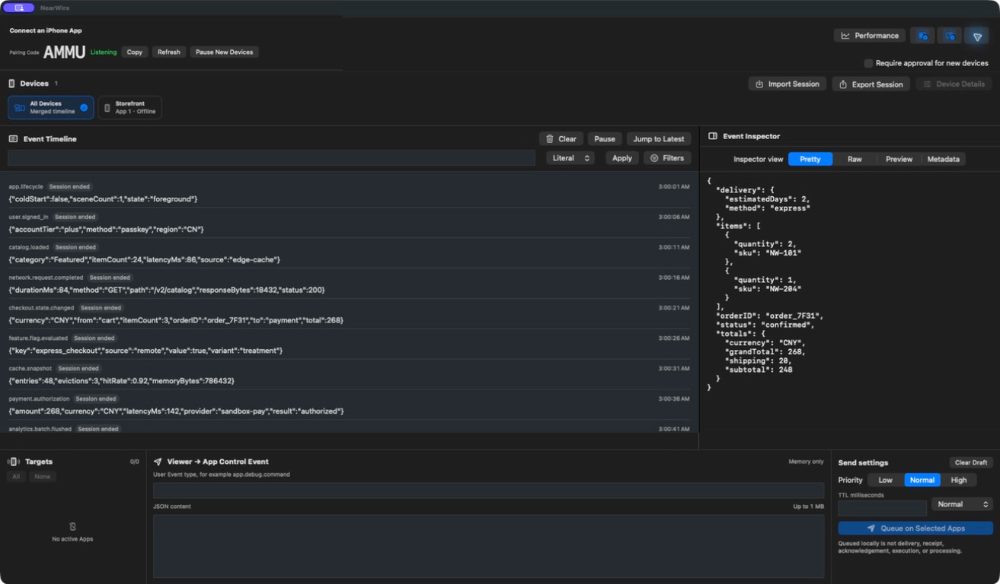
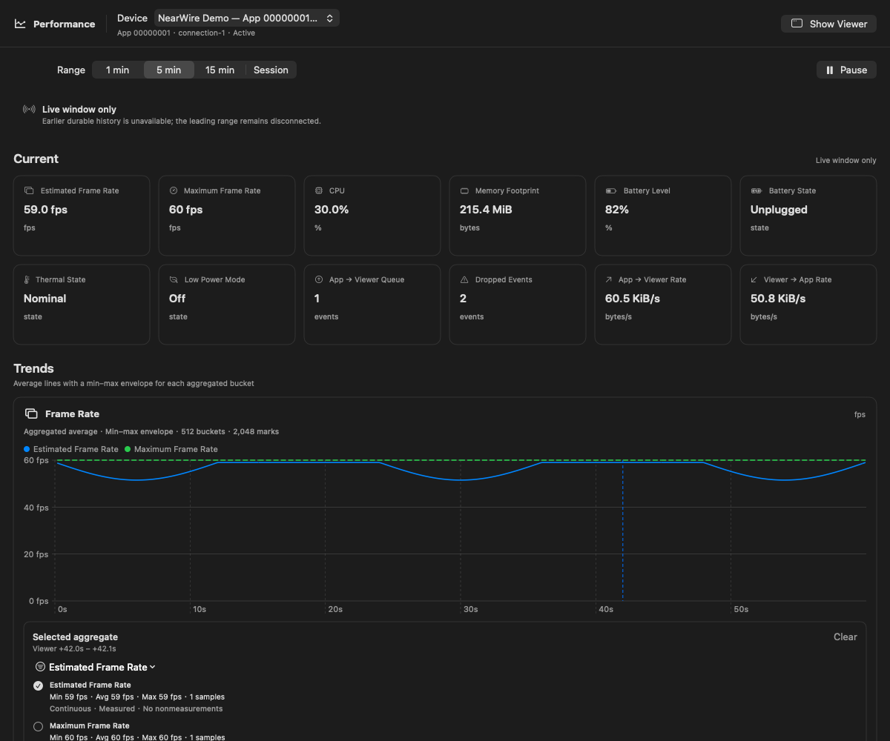

<div align="center">
  <h1>NearWire</h1>
  <p><a href="README.zh-CN.md">简体中文</a></p>
  <p><strong>A direct event channel between your iOS App and your Mac.</strong></p>
  <p>No backend. No account. No USB cable.</p>
</div>

NearWire is a local-first, bidirectional event platform for iOS development. Add the Swift SDK to an App, open the native macOS Viewer, enter the pairing code, and start exchanging structured events over an encrypted nearby connection.

It is designed for the moments when logs are not enough: inspecting live application state, following a complex flow, sending a debug command back to a device, or watching performance signals across several Apps at once.

<p align="center">
  
  <br>
  <sub>Native macOS Viewer · event timeline, search, filtering, and structured JSON inspection · demonstration data</sub>
</p>

## Why NearWire

### Local by default

The iOS App talks directly to the Mac Viewer. Bonjour handles nearby discovery, peer-to-peer-enabled networking removes the same-Wi-Fi requirement where Apple platforms can establish a nearby link, and TLS 1.3 protects the transport. There is no server to deploy or team account to configure.

### Events, not just text logs

Every message has a type and Codable JSON content. That small contract is flexible enough for navigation traces, network summaries, state snapshots, feature controls, diagnostic commands, or your own domain-specific tooling.

### Bidirectional on purpose

Apps can send events to the Viewer, and the Viewer can send events back. NearWire is useful both as an observability surface and as a lightweight development control plane.

### Explicit and predictable

`NearWire` is an instance, not a singleton. Connecting, disconnecting, buffering, performance sampling, and optional UI are all controlled by the host App. Bounded queues, rate limits, TTLs, and keep-latest delivery policies keep high-frequency streams from growing without limit.

## How it fits together

| iOS Apps | Nearby encrypted link | macOS Viewer |
| --- | :---: | --- |
| Add the `NearWire` SDK | Bonjour discovery | Opens ready to listen |
| Send and receive Codable events | TLS 1.3 | Inspect, search, and filter |
| Optionally publish performance snapshots | Bidirectional | Send controls back to an App |
| One Viewer per App connection | ⇄ | One Viewer can host multiple Apps |

The six-character pairing code selects the Viewer advertised nearby. It is intentionally short-lived and easy to replace when switching Macs. It is a discovery selector, not a password or certificate credential.

## Quick start

### 1. Add the SDK

With Swift Package Manager, add:

```text
https://github.com/TangentW/NearWire.git
```

Then link the `NearWire` product to your iOS target. Add `NearWireUI` or `NearWirePerformance` only when you need those optional capabilities.

With CocoaPods:

```ruby
pod "NearWire"

# Optional
pod "NearWire/UI"
pod "NearWire/Performance"
```

NearWire supports iOS 16+, macOS 13+, Xcode 16+, and Swift 5 language mode.

### 2. Connect and send an event

Open the NearWire Viewer on your Mac and copy its pairing code into the App:

```swift
import NearWire

struct CheckoutSnapshot: Codable, Sendable {
  let orderID: String
  let itemCount: Int
  let total: Decimal
}

let nearWire = NearWire()

try await nearWire.connect(code: "N7K4PX")

_ = try await nearWire.send(
  type: "checkout.snapshot",
  content: CheckoutSnapshot(
    orderID: "order_7F31",
    itemCount: 3,
    total: 268
  )
)
```

Events may be queued before a connection exists. The default in-memory buffer is bounded, and encoded JSON content for one event may be up to 1 MiB.

### 3. Receive an event from the Viewer

```swift
struct FeatureFlagOverride: Codable, Sendable {
  let name: String
  let enabled: Bool
}

for try await event in nearWire.events {
  guard event.type == "feature.flag.override" else { continue }

  let override = try event.decode(FeatureFlagOverride.self)
  await featureFlags.apply(override)
}
```

Incoming events use `AsyncThrowingStream`; connection state and status are available as modern Swift asynchronous sequences as well.

## Optional building blocks

### Drop-in SDK panel

The optional SwiftUI panel can provide connection controls, an explicit performance collection
toggle, and the latest Event sent by the Viewer:

```swift
import NearWire
import NearWireUI
import NearWirePerformance

let nearWire = NearWire()
let performanceMonitor = NearWirePerformanceMonitor(nearWire: nearWire)

NearWirePanelView(
  nearWire: nearWire,
  performanceMonitor: performanceMonitor
)
```

The panel starts neither a connection nor performance collection by itself. The App owns both
instances and decides when the panel is visible. `NearWireConnectionView`,
`NearWirePerformanceControlView`, and `NearWireLatestViewerEventView` are also available separately
for custom layouts. The latest-Event view uses an independent bounded subscription, so it does not
consume Events from the App's own observer.

### Built-in performance snapshots

The optional performance module can also be controlled directly and publishes aggregate device and
App signals through the same event channel:

```swift
import NearWirePerformance

let monitor = NearWirePerformanceMonitor(nearWire: nearWire)
try await monitor.start()
```

Sampling starts only when the host App asks for it. The Viewer opens performance analysis in a dedicated window.

<p align="center">
  
  <br>
  <sub>Dedicated performance window · frame rate, CPU, memory, battery, and thermal signals · demonstration data</sub>
</p>

## Design boundaries

- NearWire is a development-time event channel, not a production telemetry backend.
- Transport is always encrypted, but the current pairing code does not authenticate a pre-trusted Viewer identity.
- A successful `send` means the event entered the local delivery path; it is not an end-to-end acknowledgement.
- Offline buffering is in memory and does not survive process termination.
- NearWire does not silently take ownership of your App lifecycle or background execution policy.

These boundaries keep the SDK small, understandable, and easy to remove from a host App when it is not needed.

## Explore the project

- Run the maintained [Demo App](Demo/README.md) to see connection UI, bidirectional events, queue diagnostics, and performance sampling together.
- Browse [Documentation](Documentation) when you need the full public API, distribution, transport, or protocol details.

NearWire is distributed under the [MIT License](LICENSE).
